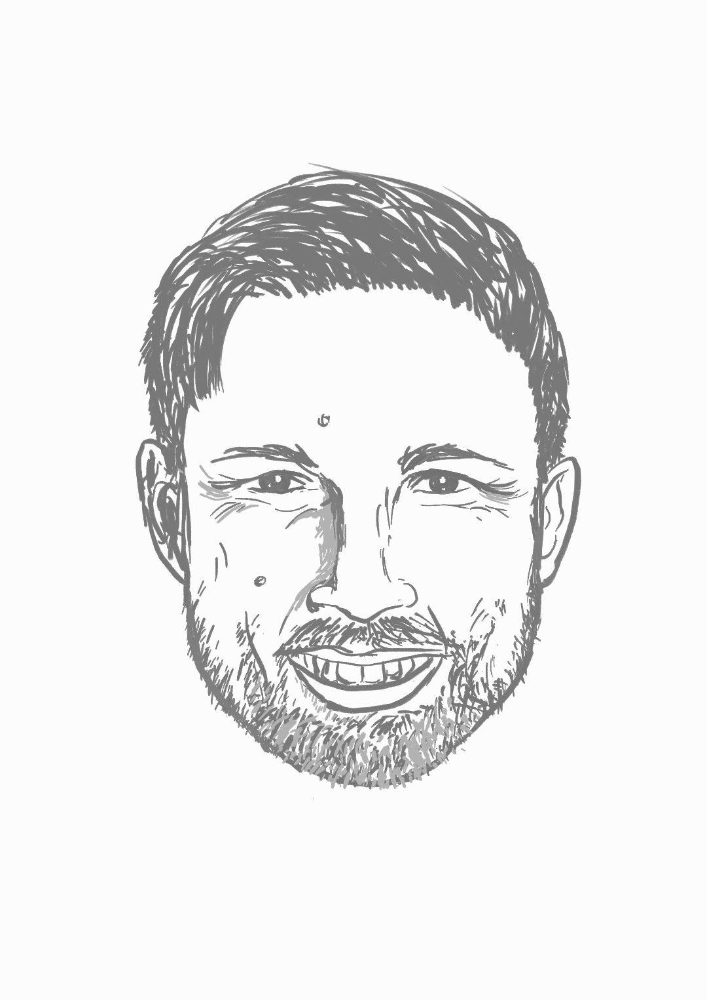

```{=html}
<style>
/* Hide Quarto's automatically generated title/subtitle/date block on episode pages. */
#title-block-header,
.quarto-title-block {
  display: none;
}
</style>
```

::: {.episode-shell}
::: {.episode-hero}
<p class="eyebrow">Season 1 · Episode 2</p>

# Cybernetics and Control

How do we steer complex systems? Our guest speaker, Jochen Trumpf, invites us to explore the fundamentals of control through the lenses of science, engineering, and mathematics.

::: {.audio-card}
## Listen

```{=html}
<div class="listen-links" aria-label="Listen to this episode on external platforms">
  <a class="listen-icon-link" href="https://open.spotify.com/episode/2C7c63C7LAQxtnJSGybiDj?si=2jaq8oGaQ9mxF6bFOTqwiQ" target="_blank" rel="noopener noreferrer" aria-label="Listen on Spotify">
    <i class="bi bi-spotify" aria-hidden="true"></i>
    <span class="visually-hidden">Spotify</span>
  </a>
  <a class="listen-icon-link" href="https://youtu.be/Vwydya1s2PE?si=j9gGXQtW5zuEA13H" target="_blank" rel="noopener noreferrer" aria-label="Watch on YouTube">
    <i class="bi bi-youtube" aria-hidden="true"></i>
    <span class="visually-hidden">YouTube</span>
  </a>
</div>
```
:::
:::

## Guest speaker

::: {.speaker-card}
::: {.speaker-photo}
{fig-alt="portrait-jochen"}
:::

::: {.speaker-bio}
### Jochen Trumpf

Jochen Trumpf received the Dipl.-Math. and Dr. rer. nat. degrees in mathematics from the University of Würzburg, Germany, in 1997 and 2002, respectively. He is currently a Professor in the School of Engineering at the Australian National University. His research interests include observer theory and design, linear systems theory and optimisation on manifolds with applications in robotics, computer vision and wireless communication. He currently serves as Associate Editor for Mathematics of Control, Signals, and Systems (MCSS).
:::
:::

## Quick quiz

```{=html}
<div class="quiz-card interactive-quiz">
  <div class="quiz-stage" aria-live="polite"></div>
  <script type="application/json" class="quiz-data">
	[
		{
		  "question": "In control theory, what do engineers call a quantity that changes over time, like water temperature?",
		  "options": [
		    {
		      "text": "A number",
		      "correct": false,
		      "feedback": "A signal can contain numbers, but the key idea is that it changes over time."
		    },
		    {
		      "text": "A noise",
		      "correct": false,
		      "feedback": "Noise is an unwanted disturbance or uncertainty, not the general term for a time-varying quantity."
		    },
		    {
		      "text": "A signal",
		      "correct": true,
		      "feedback": "Correct! A signal is a quantity that varies over time and carries information about a system."
		    },
		    {
		      "text": "A guess",
		      "correct": false,
		      "feedback": "A guess is an estimate, not the control-theory term for a changing quantity."
		    }
		  ]
		},
		{
		  "question": "What’s the central idea borrowed from cybernetics that Jochen highlights in control?",
		  "options": [
		    {
		      "text": "Randomness",
		      "correct": false,
		      "feedback": "Randomness can affect systems, but it is not the central cybernetic idea highlighted here."
		    },
		    {
		      "text": "Feedback",
		      "correct": true,
		      "feedback": "Correct! Feedback is central to both cybernetics and control: systems use information about their behaviour to adjust what they do next."
		    },
		    {
		      "text": "Perfection",
		      "correct": false,
		      "feedback": "Control theory often deals with uncertainty and imperfection rather than assuming perfect systems."
		    },
		    {
		      "text": "Isolation",
		      "correct": false,
		      "feedback": "Cybernetics focuses on interaction, communication, and regulation, not isolation."
		    }
		  ]
		},
		{
		  "question": "What’s the main job of an observer in control theory?",
		  "options": [
		    {
		      "text": "To estimate hidden parts of a system using what can be measured",
		      "correct": true,
		      "feedback": "Correct! An observer uses available measurements and a model to estimate system states that cannot be directly measured."
		    },
		    {
		      "text": "To watch engineers at work",
		      "correct": false,
		      "feedback": "In control theory, an observer is a mathematical or algorithmic tool, not a person watching engineers."
		    },
		    {
		      "text": "To measure everything directly",
		      "correct": false,
		      "feedback": "Observers are useful precisely because we often cannot measure everything directly."
		    },
		    {
		      "text": "To remove feedback from the system",
		      "correct": false,
		      "feedback": "Observers often support feedback control by estimating the information needed for control decisions."
		    }
		  ]
		}
	]
	</script>
  <noscript>
    <p>This quiz needs JavaScript to reveal questions and answer feedback interactively.</p>
  </noscript>
</div>
```

## Transcript

<details class="transcript-toggle" tabindex="0">
<summary>Open transcript</summary>
<div class="transcript-content">
Speaker 1 (Rebbecca): Today, we have the pleasure of having Professor Jochen Trumpf. 

Speaker 2 (Sungyeon): Professor Jochen Trumpf is from the School of Engineering at the Australian National University. Welcome, Jochen. It’s really awesome to have you here for this episode. 

Speaker 3 (Jochen): Thanks for having me. 

Speaker 2: We learned that you have a strong background in mathematics from undergraduate through to PhD, and that’s super Cool. So what was the charm? 

Speaker 3: The charm of mathematics. There was quite literally a charm, but in some indirect way. So when I finished high school, I was actually planning on studying philosophy because I enjoyed that very much as an elective course in my last two years at high school. And so I set myself up, you know, to do civil service in Freiburg – lovely town in the South of Germany, which has a famous university with a really great philosophy faculty. And so I was all set to study there. And then I started a relationship. 

Speaker 1: Hmm. 

Speaker 2: Aww. 

Speaker 3: You know the way that the German system works with places at university, it ended up meaning that if I wanted to be in the same city as my partner at the time I had to move, and so the place that ended up being the best compromise, philosophy wasn’t really an option there, and so, you know, because the part of philosophy that had interested me the most was logic anyway, I thought, well, logic, I can also do in mathematics and so that’s how I ended up enrolling in the mathematics degree and ended up loving it. So the short version. 

Speaker 2: Ohh that’s very sweet! 

Speaker 1: But do you mind if I ask what is it about philosophy that actually attracts you in your last two years of your high school? 

Speaker 3: I think it’s the reflective practise. You know that it’s a discipline that makes you think about yourself, about your place in the world about, you know, what is going on around you in sort of more expansive ways than and you get for example, in natural science disciplines. I did end up studying physics as part of my degree at the university, and so I have an affinity for that. But I was attracted to the broader perspective that philosophy brings. 

Speaker 2: Yeah. Then how did you end up coming to Australia? 

Speaker 3: Yeah, so that’s as usual, relationships between people, right? So the person who hired me at the at the ANU was a professor, John Moore, who passed away a few years ago. And so he was a close friend and collaborator of my PhD advisor, Uwe Helmke, in Würzburg, and I actually met John on a couple of his visits to Würzburg. And so he ended up getting funding from the ANU to hire a postdoc. And so he contacted me – it was a funny episode – I was on the train with my supervisor to Berlin to go to a conference, and so, you know, they desperately had to reach us because there was a deadline. And so I didn’t have much time to think about it. I didn’t have much time to think about the fact that Australia is very far away.  

Speaker 2: Ohh yeah. 

Speaker 3: And so I just put in an application and that’s what happened. 

Speaker 1: Ohh wow. Well, you literally moved from one end of the world to the other end of the world. So I guess that’s different kind of lifestyle, I suppose. 

Speaker 3: Oh yeah, very differently. So you know, when I came here, I had no intention of staying, but I came here for a five-year position, and you know, I was thinking “have a little adventure, go back home,” and I’m still here.  

Speaker 1: And I guess I guess Canberra, Australia, is treating you very well then.  

Speaker 3: I can’t complain. 

Speaker 1: Ohh that’s nice, that’s cool. As a mere engineer, it is really impressive that you are interested in like hardcore mathematics, philosophy, and physics. and now you are in the control realm.so could you tell us a little bit about your insights into control? 

Speaker 3: OK so. Maybe, let me start by giving an example of what control is actually all about.  

Speaker 1: Oh, OK. 

Speaker 2: Sure. 

Speaker 3: So you know the example that I like to use with students or people who haven’t been exposed to systems and control theory as a field is that of hot water in the shower. Because you know, that tends to be a daily experience for most of us.  

Speaker 2: Yep. 

Speaker 3: And so the, you know, we all have our struggles with that where the shower is never at the temperature we want it to be. If we are too impatient at the moment when we’re getting into it, it’s too hot, then too cold, these sorts of things, right? And so, control is really about building systems – so that’s, you know, a term we inherited and borrowed from cybernetics – that achieve a certain desired goal. So in this case constant water temperature at the temperature that we wanted at for how long as we want it. And so control is all about achieving that. And so the first step in how we go about that is that we build a model of the system that we are discussing, right? And so in our context model typically means a mathematical model, so some form of equation and that we then use to try to, you know, find a way of influencing the behaviour of the system that we are looking at. So in this case, you know, make the shower at the temperature that we wanted that. 

Speaker 2: Mm-hmm. 

Speaker 3: And so, uhm, you know, maybe the most fundamental concept in this modelling world is what we call a signal, and so this is where one of the important components comes in, which is when we talk about behaviour of a system, we always at the back of our minds think in terms of how that behaviour is changing over time. So that is possibly one of the most important aspects of systems and control theory in particular. 

And so a signal for us is a physical or it can be chemical, biological; it can be social quantity that we can measure and that we can repeatedly measure, right? So we get values for that quantity, say the temperature of the water hitting my skin or the pressure in the pipe that you know connects the pump to the shower head. That’s what we mean when we say quantity. They change over time. And so how they change over time that’s what we call a signal. 

And so then the modelling that we do is trying to mathematically describe the interaction between multiple signals. So how does it change in pressure affect the temperature? You know, how does me changing the electrical input into the water heating element? So, you know, putting higher currents through. How does that change the water temperature? How does that then in turn change the pressure, and so on over time.  

Speaker 2: Right. 

Speaker 3: And so this is where, you know, another idea of cybernetics is informing our field. That’s the idea of feedback. So where you think in terms of one signal influencing another signal and that other signal in turn influencing the first signal back? And so how do you analyse this sort of situation and that situation is pervasive, right? And so, you know from my perspective, formulating and clarifying the concepts of systems and feedback are actually probably the most two important contributions that cybernetics has made to all of science, and they are so central to our field – systems and control theory – that most people who study these days don’t even know that these are borrowed terms.  

Speaker 2: Oh, I see. Yeah. 

Speaker 3: So you know they believe that we invented them, right? You know, we didn’t. We borrowed them. 

Speaker 2: Humble mindset. 

Speaker 1: Yes. 

Speaker 2: Yeah, that’s really cool. So you talked about systems and feedback when it comes to building a control system, or control model, right? Then would it be only about the system itself or whether there would be other factors that are affecting the dynamics of the system? 

Speaker 3: Yes. So you used the word dynamics. So we should probably come back to that at a later point. 

Speaker 2: Hmm. Yes, sure. OK. 

Speaker 3: But one of the fundamental ways that our modelling paradigms work is that they’re trying to compartmentalise the world, right? So, you know, I know that this is always a controversial way of going about things, in particular, when you talk to social scientists because they tend to use different kinds of models and different kinds of approaches.  

But when you’re an engineer, this way of modelling and thinking where you are encapsulating parts of the reality that you’re trying to model into a black box, and where you’re kind of randomly drawing the boundary of that black box and then you know you’re restricting your modelling of the system to the inside of that black box and you’re conceptualising the way that the interaction to the wider world happens as specified interfaces between that black box and either other black boxes or, you know, a black box that is the universe, the rest of the universe. So that’s how we think in terms of our modelling. And I guess, I mean, if you want to be critical about it, it’s mostly driven by the fact that that’s the only way how we know to solve problems. So that’s really what drives this more than anything. 

Speaker 2: I see, practicality then. 

Speaker 3: And yes, so you know this is probably where if you broaden your perspective a little bit and think about the differences in approach of different sciences. So then maybe that makes it more understandable. And so I like this caricature, where a a scientist is after “absolute truth” and an engineer is after “approximate truth”, right? So that’s good enough to achieve the one outcome that they really care about. So in this case, constant water temperature of my shower. 

Speaker 1: Exactly. So we engineers are problem solvers. 

Speaker 3: Yeah, I think that’s a fair characterisation. And so, you know, as a mathematician, you find yourself in that curious in-between position, where all of mathematics deals in “relative truth”. So you know, all the statements that mathematics ever produces are of the kind, well, if you believe this thing, then you also need to believe that thing or if you believe that this thing is wrong, then you also need to believe that this thing over here is wrong. So the only kind of statement that mathematics can actually make. And you know, I know that this is not what you think about mathematics when you come right out of high school, but you know that is what mathematics actually fundamentally is. It’s about relative truth. 

And so it marries very well with this engineering mindset of getting close enough to the truth in order to achieve the design goal that you have for your system. Because, you know, it allows you to reason in an environment where you know you are not actually talking about the absolute truth. But that doesn’t matter for what you’re trying to do. 

Speaker 1: Yeah, that makes sense. That makes a lot of sense. I mean, as an engineer myself, in research, we really focus on very specific problem and we know that there are other cases, but we don’t really care about those first, like, we just focus on that particular one. So I guess that’s the approximate truth, I suppose. 

Speaker 2: Well, as for me, it’s really interesting to see the different mindsets between people with different disciplinary backgrounds and training because as for me, with my background in mathematics, I felt like, well, there are always a lot of different ways that we can achieve a goal, and when it comes to choosing the best way, it will be about like optimising the way, lowering or minimising the cost so that we can make something happen without putting too much effort, right?  

So yeah, it’s really interesting when it comes to modelling, especially if there are a lot of ways, then how do we optimise things? And how engineers approach getting that approach right? So how would you explore such different ways then? 

Speaker 3: Yeah. So that there’s a discipline in engineering which has existed since about the 1950s, and that’s called systems engineering. And so that’s the engineering discipline that actually studies this question that you just put. And so you know, it’s an interesting historical story because it was invented in three different places almost simultaneously. And it actually took people almost a decade to figure out that they were talking about the same thing! This is usually the case. 

Speaker 1: Language barriers. 

Speaker 3: So you know it was invented for the US American space programme. It was separately invented in the shipbuilding industry in Japan and separately invented again in Switzerland with large-scale machinery for power plants. 

Speaker 1: Right. 

Speaker 3: And so you know what’s common between those three applications is that they are maybe the possibly the three first kind of human technology applications where the scale and the complexity exceeded the capacity of a single person, like fundamentally. That’s where it is just no longer possible for one lead engineer to understand the entire thing that they’re trying to build. 

Speaker 2: Right, yeah. 

Speaker 3: And so what needed to be created is a set of methods and tools that allow to systematically answer questions like: so if I’m looking at this part of the system, how do I now choose what model I use, right? How do I choose what I’m optimising for without then jeopardising what happens once that module that I’m building is put into the spaceship and sent to the moon. 

And so being very clear about modelling paradigms, being clear about interfaces between subsystems, being clear about how you break down a system into subsystems such that you are not destroying the overall system functionality and then how you systematically go about putting in different design. We call them design metrics, right? So, different concerns, different things you care about. You mentioned cost as one driver. There are engineering methods and metrics, like you know, you don’t want your shower to weigh 5 tonnes, for example, and things like that. And so, you know, how do you actually go about systematically exploring what we call the design space – what are all the possible compromises that you could make and how to do it and go about choosing the right quote and compromise. So that’s what system engineering is. 

Speaker 1: I see. So I think in system engineering, well, you do have, say, signals and stuff inside where you can extract whatever state that you want. But I guess what I learned in my control systems theory classes is that not every time that you can get these kind of signals at all points. And that’s where you sort of implement observers or what we call as estimators as well. And I guess that’s also one of your research interests, I suppose, observer theory. 

Speaker 3: Yes. So I mean, I would say that is my area of expertise: observer theories. 

Speaker 1: Yes. 

Speaker 3: So you know, you mentioned estimators, or filters, as we also call them. So the difference between observers and filters is really the modelling paradigm, where observers are deterministic system models; estimators and filters are stochastic system models. But the underlying philosophy for both of them is the same. So I mean, you mentioned state, so you know another concept that was originally developed in the world of cybernetics and then, you know, made mathematical in my field – systems and control – by a guy called Rudolph Kálmán. 

So the way we think about the dynamics – coming back to that word of the system – is it’s not only about the behaviour that happens in time, but it’s actually the reasons for the behaviour. So the example that I tend to use for this that sort of shows a little bit what the tricky part of it is if you’re in your car and you’re driving on the road, right? So there’s a curve coming up. 

Speaker 1: OK. 

Speaker 3: So what are you going to do, right? So depending on how reckless you are? You know, you will somehow maybe use the brake a little bit at least, and you’re going to turn your steering wheel. And so, you know, these are processes over time, right? So you’re gonna adjust the steering wheel a couple of times while you’re in the curve adjusting to what’s ahead of you. You know, you might reduce the speed a little bit when you get scared and that sort of thing, right? 

Speaker 1: Mm-hmm. 

Speaker 3: So now you do the exact same thing that you just did in that curve again the next day. But the difference is that yesterday you were approaching the curve at 60km/h and today you haven’t paid attention and you’re at 80km/h.  

Speaker 1: Ohh. 

Speaker 3: What do you think will happen if you do exactly the same thing as you did yesterday? You’ll probably struggle to make the curve, right? Unless you are a very defensive driver. And so, this is what dynamics is all about, right? So what is the difference here? The difference is the state of the car at the time when you’re entering the curve, right? So that is the only difference. And so, you know, if you think in terms of physics, or you know, the way we think about these kinds of technical systems. Today, your car had way more energy than yesterday. And so that energy gets converted, for example, into heat, friction of your tyres on the road. If you exceed certain thresholds, that becomes catastrophic, and you’re going to fall out of the curve, right? And so it’s not because you did something different, it’s because the state of your car was different. And so dynamics is always about this interplay between how do you interact with the system and what is the stored internal state of the system when you are interacting. So that’s sort of fundamentally the thing.  

And so, that already tells you that in order to achieve a control goal for, you know, things like, I want the right temperature on my skin and my shower. You actually need to understand the system state. So in this case you need to understand, well, what’s the thermal energy inside the water tank, right? You know, what is the state of the heating element inside the water tank? At what temperature is it currently at? Right. And then you know, what’s the state of the valve that I’ve turned, changing the pressure in the pipe and the flow rate in the pipe, right? And so, unless I know all of these things, I cannot really achieve that constant temperature that I want to have, because if any of these states is different, then the same action that I take will result in a different outcome. 

And so, now we come to that challenge that you phrased, where sometimes you cannot measure some of these signals, right? So you know, in a shower you theoretically could. So we’ve got sensors for all of the things that I talked about. There it’s more a matter of cost. So if you build a shower that has all of these sensors, you know, it’s too expensive. No one would buy it, right? 

Speaker 1: $2000 shower. 

Speaker 3: Yeah, exactly. But there are other cases, you know, of technical systems where it’s actually physically impossible to make those sorts of measurements. So, you know, an example that always comes to mind is trying to measure the core temperature inside the core of a nuclear reactor. 

Speaker 1: Oh. 

Speaker 3: Well, good luck with that. And so, what observer theory in the sense that we use it in my discipline is about is trying to create algorithms. 

Speaker 1: OK. 

Speaker 3: So an observer for us is a word for a particular type of algorithm that takes measurements of some of the signals that you can measure or have decided to measure of your system. And then uses the model that we’ve built for the system to try to infer, well, if I’ve got these measurements and if I’ve got that model, what must the values of the other signals that I’m not measuring B. OK, so that’s what it’s trying to compute. And then, you know, it is a mathematical theory. So you ask the usual questions of “Can it be done?”, “When can it be done?”, “If it can be done, do we know how to do it?”, and so on. 

Speaker 2 : Well, you did tell us that an observer can be understood as an algorithm, and in my understanding, an algorithm tells us a step-by-step kind of instruction as to how to compute something that we desire, for instance. And in this case, what we can’t observe can be computed using that type of algorithm, where parameters are taken from what we can observe. Is it correct? 

Speaker 3: Yeah. So, except that we tend to not use the word observe in the way you just did to not get confused. So we talked about “measured” as opposed to “observed”, right. And so you know, we would say that the output of my algorithm, the output of my observer, are quantities that I have now observed. Yes, I did indirectly compute them from the things that I could directly measure, but in the way that I think about the system, it’s basically as good if I’d measured it. And so, keeping in mind that engineers deal an approximate truths, right? So I know it’s not the full truth, but it doesn’t matter as long as it’s good enough. 

Speaker 2: Oh, I see. So it sounds like the algorithm is a kind of a mathematical way of predicting or maybe, explaining the relationship between parameters that we can’t measure and those that we can’t measure, right. 

Speaker 3: So, you know, systems and control theory is a very mathematical discipline. It sits squarely, you know, between mathematics, engineering, and computing, right? And so it’s, but it is a mathematical discipline at its core, which means that it comes with very precise language for these kinds of things. And so we actually draw a distinction between what we call a predictor and what we call an observer. And so the distinction is that an observer is about giving me the current value, as in right now. Then a predictor is about trying to give me a future value. And so, you know, Rebbecca knows way more about this than I do: PID controllers. 

Speaker 1: Well, I think everybody in systems and control knows PID. 

Speaker 3: Yeah, you know better than I do. 

Speaker 1: Oh… 

Speaker 3: So, you know, one of the things that we had to realise as a field in the 1950s is that sometimes you need to predict a little bit further into the future in order to be able to control now, effectively.  

Speaker 1: Right. 

Speaker 1: Hmm. 

Speaker 3: But as I said, you know, it’s a mathematical discipline, and so, we tend to be very precise with how we call these things. 

Speaker 2: Right. It’s interesting because I’ve always been, well, I am more familiar with the way of, say, learning from the past to get the current state right or get some future states right. But it’s interesting to know that there are ways where we get some information about future states, like prediction, to get the current state understood right. 

Speaker 3: Yeah. So. 

Speaker 1: Well, Sungyeon, I remembered you kept telling me about something which is very similar with that observer thing. Second-order cybernetics? 

Speaker 2: Oh yeah, absolutely. So yeah, it came to my mind that second-order cybernetics can be quite aligned with what you just told us when it comes to observer theory because in 2nd order cybernetics an observer should be counted and considered in order to understand the dynamics of a system that the observer is observing along with the environment. So yeah, I thought that it can be understood probably at the same level or upper level –  there might be a little bit of difference. 

Speaker 3: Yes. So there is a philosophical difference, and so, you know, from the perspective of second-order cybernetics, I think the observer theory that I do would be regarded as first-order. OK so, you know, one of the differences here is – and I mean, I know that some second-orders cybernetics people prefer the term “participant” opposed to “observer” to indicate the fact that the observer is actually part of the system in some sense and so influences the behaviour of the system through their observation. So this is where we again, you know, as a mathematical discipline, draw very, very fine distinctions.  

The observers that I just described, they work within modelling and scientific paradigm that is classical. So in the sense that you’re building a mechanism that is conceptualised as actually not influencing the behaviour of the system. So if I put a sensor somewhere, then I’m trying to construct that sensor in a way that it is actually not changing the behaviour of what we call the plant, right? So the system that we are trying to control. 

So again, Rebbecca knows more about this than I do. We know from quantum mechanics that that’s not always possible, right? And so I guess, you know, you could take that as a natural science justification of the second-order cybernetics approach if you want. You have to actually account for situations where that you cannot decouple this. 

Speaker 2: Uh-huh. 

Speaker 3: It’s again worth remembering that these engineers we treat, we deal in approximate truth – Approximately you always can. And so, you know, in some circumstances it’s even a mathematical theorem I can prove to you. It is one of the contributions I’ve made to my field, right? And so, the way we go about modelling in this context again is that we think of the observer part as the part that doesn’t actually influence the system dynamics. It is then the subsequent controller part as we call it that does the influencing of the system. So that is how we think. And so we end up with a three part feedback loop where you’ve got your system, you take measurements through your sensors, those sensors go into an observer or filter that produces estimates of the other variables in the system – the other signals that you haven’t measured. And then based on all of this information – the measurements and the estimated signals – the controller then tries to influence the system through what we call actuators, right? So in this case, increasing the at the current through the heating element, you know in a fancy shower, you’d have an electronic valve that you can open or close, and things like that. 

Speaker 2: Right. Excellent. 

Speaker 1: Yeah. Excellent. Well, it’s really so interesting actually to hear different, you know, different perspectives rooted from different disciplinary backgrounds as in how we look at the same problem but from different points of view, like from a mathematician point of view, engineer, or say just general scientist, or maybe a philosopher as well, which is pretty interesting. And now we actually can view like a control problem as a cybernetic problem, and even as a philosophical problem.  

Speaker 2: Yeah, exactly. So, you know, now I finally understand my cohost behaviours when it comes to approaching a problem.  

Speaker 3: Happy to help. 

Speaker 2: Well, I can give you an example. So when we are both hungry, I would always Rebbecca, “OK, So what do you feel like?” And her answer would always be like “Anything!” And so I’d be like, “OK, well, you know, we had Thai yesterday and Indian the other day. So why don’t we now consider something else?” So you see, I guess this is exactly how different engineers are from mathematicians. 

Speaker 1: Well, I guess we’re gonna have Chinese then today. 

Speaker 3: I’ve just returned from Singapore, so I can recommend that. 

Speaker 2: Ohh. Problem solved.  

Speaker 1: Awesome. 

Speaker 2: Yeah, thanks a lot again Jochen for such an insightful chat. 

Speaker 3: It’s my pleasure. 

Speaker 1: Well, thanks. 
</div>
</details>

:::
