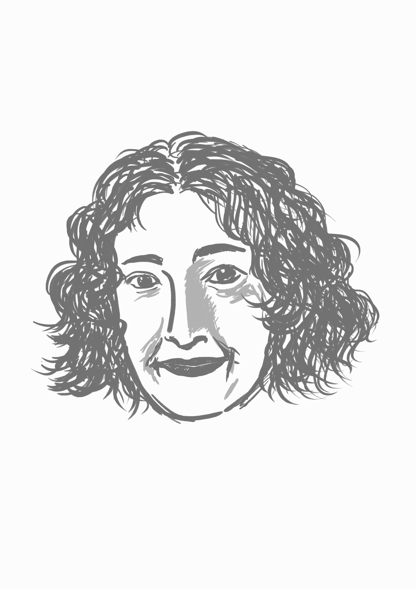

```{=html}
<style>
/* Hide Quarto's automatically generated title/subtitle/date block on episode pages. */
#title-block-header,
.quarto-title-block {
  display: none;
}
</style>
```

::: {.episode-shell}
::: {.episode-hero}
<p class="eyebrow">Season 1 · Episode 3</p>

# Indigenous Knowledge in Cybernetics and AI

Multi-talented Angie Abdilla shares how Indigenous knowledge systems, creative practice, and strategic design converge to shape technology. From feedback loops to kinship systems, she explains that technology, AI, and automated systems are embedded within cultural systems and relationships rather than existing as purely technical artefacts.

::: {.audio-card}
## Listen

```{=html}
<div class="listen-links" aria-label="Listen to this episode on external platforms">
  <a class="listen-icon-link" href="https://open.spotify.com/episode/0WXRXwBxpltBLzZALbNCbo?si=ATPSTcRdTT2rK__do9hj7w" target="_blank" rel="noopener noreferrer" aria-label="Listen on Spotify">
    <i class="bi bi-spotify" aria-hidden="true"></i>
    <span class="visually-hidden">Spotify</span>
  </a>
  <a class="listen-icon-link" href="https://youtu.be/yZ_3-vbQ7Oc?si=tuEga6---qP-ZZTW" target="_blank" rel="noopener noreferrer" aria-label="Watch on YouTube">
    <i class="bi bi-youtube" aria-hidden="true"></i>
    <span class="visually-hidden">YouTube</span>
  </a>
</div>
```
:::
:::

## Guest speaker

::: {.speaker-card}
::: {.speaker-photo}
{fig-alt="portrait-angie"}
:::

::: {.speaker-bio}
### Angie Abdilla

Professor Angie Abdilla palawa is the founder and director of Old Ways, New, and is affiliated with the School of Cybernetics at the Australian National University. In her various roles as a strategic designer, creative practitioner, and consultant, Angie advocates for Indigenous peoples, knowledges, and knowledge systems as foundational to technology automation through design and cultural practice. Her published research interrogates the praxis of Indigenous deeptime technologies and Artificial Intelligence, which continue to be informed by the Indigenous Protocols and AI working group (IP//AI), which she co-founded. As a creative practitioner, she works across film and video installation as an exhibiting artist. She created the company’s strategic design methodology, Country Centered Design, leading projects for the public and private sectors over the past decade. Angie continues to advise on the cultural and ethical affordances of automated systems and technologies internationally and locally.
:::
:::

## Quick quiz

```{=html}
<div class="quiz-card interactive-quiz">
  <div class="quiz-stage" aria-live="polite"></div>
  <script type="application/json" class="quiz-data">
	[
		{
		  "question": "In Indigenous worldviews, when discussing AI, the emphasis is placed on:",
		  "options": [
		    {
		      "text": "Rights",
		      "correct": false,
		      "feedback": "Rights are important, but Angie emphasises a broader relational perspective centred on obligations and care."
		    },
		    {
		      "text": "Responsibility and care",
		      "correct": true,
		      "feedback": "Correct! Indigenous perspectives often focus on responsibilities, relationships, and caring for people, communities, and Country."
		    },
		    {
		      "text": "Profitability",
		      "correct": false,
		      "feedback": "Economic outcomes may matter, but they are not the primary focus discussed in the episode."
		    },
		    {
		      "text": "Efficiency",
		      "correct": false,
		      "feedback": "Efficiency is often emphasised in technology development, but Indigenous approaches prioritise relationships and responsibility."
		    }
		  ]
		},
		{
		  "question": "What is one of the key purposes of Indigenous kinship systems mentioned by Angie?",
		  "options": [
		    {
		      "text": "To standardise language across groups",
		      "correct": false,
		      "feedback": "Kinship systems serve many social functions, but language standardisation is not their primary purpose."
		    },
		    {
		      "text": "To regulate trade and commerce",
		      "correct": false,
		      "feedback": "Trade can be influenced by social relationships, but this was not the key purpose highlighted in the episode."
		    },
		    {
		      "text": "To keep bloodlines healthy and avoid birth defects",
		      "correct": true,
		      "feedback": "Correct! Kinship systems help regulate relationships and marriages, supporting healthy and sustainable communities across generations."
		    },
		    {
		      "text": "To enforce political hierarchy",
		      "correct": false,
		      "feedback": "Kinship systems organise responsibilities and relationships rather than simply enforcing hierarchies."
		    }
		  ]
		},
		{
		  "question": "Apart from regulating marriages, Indigenous kinship systems also:",
		  "options": [
		    {
		      "text": "Manage natural resources through responsibilities to totems",
		      "correct": true,
		      "feedback": "Correct! Kinship and totemic relationships help distribute responsibilities for caring for species, ecosystems, and natural resources."
		    },
		    {
		      "text": "Control trade between clans",
		      "correct": false,
		      "feedback": "Trade may occur within kinship networks, but this was not the key function discussed."
		    },
		    {
		      "text": "Govern warfare rules",
		      "correct": false,
		      "feedback": "Kinship systems influence many aspects of social life, but resource stewardship was the example highlighted in the episode."
		    },
		    {
		      "text": "Restrict the use of certain languages",
		      "correct": false,
		      "feedback": "Language practices can be culturally significant, but this is not the role of kinship systems discussed here."
		    }
		  ]
		}
	]
	</script>
  <noscript>
    <p>This quiz needs JavaScript to reveal questions and answer feedback interactively.</p>
  </noscript>
</div>
```

## Transcript

<details class="transcript-toggle" tabindex="0">
<summary>Open transcript</summary>
<div class="transcript-content">
Speaker 1 (Rebbecca): Today, we have the pleasure of having Professor Angie Abdilla.

Speaker 2 (Sungyeon): Professor Angie Abdilla is from the School of Cybernetics at the Australian National University. Welcome, Angie! It’s lovely to have you here today.

Speaker 3 (Angie): Thanks for having me, it’s great to meet you too. 

Speaker 2: I realise that it’s really hard to pick one title to describe you with your multi-talents and roles. So what do you think best describes yourself? 

Speaker 3: Oh, it’s true. It’s very hard to pin me down. I am a creative and strategic thinker, and I guess, on one hand, a creative research practitioner; on the other, a strategic designer. And often those worlds converge. Often in my creative research practice, there is strategic thinking and design that is informing that creative process. And that creative process is often driven through a cultural paradigm and cultural protocols. Likewise, within strategic design, my practice is often informed by creative practices. And also, very much culturally informed too.

Speaker 2: Right. It sounds like there’s a definite feedback loop, enhancing each other, right?

Speaker 3: Yeah, absolutely! Before I even knew what cybernetics was, the very first website I created for my company always knew we were drawing this feedback loop. Before we even knew what the name of the company was, just yarning with my uncle, and you know, trying to find what it was like a way of drawing the thing that we didn’t have words for yet. And we kept drawing this feedback loop.

Speaker 2: Right, the infinite loop!

Speaker 3: Yeah. 

Speaker 2: That does symbolise what you are doing and what you are describing yourself, I guess. So, yeah, if possible, we would like to hear more about your career journey so far. So how has it all begun?

Speaker 3: Well, I started out as an undergraduate majoring in media arts and production – a Bachelor of Arts in communication. And I was really – I’m just so inspired and excited about making films – not necessarily narrative. A lot of them was quite experimental. It was a way for me to blend these different ideas and concepts into or through a medium that enabled me to, I guess, you know, express these different ways of seeing, being, knowing in a way that touches people. You know, I think the medium of film itself is really great art and is the most incredibly impactful way to reach people. And you know, I still believe that today. 

So that led me on a journey. I loved being a filmmaker, but we got to a point where the film industry was radically changing, and I could see these changes occurring when I started scratching the surface to try and work out what was driving these seismic changes in an industry that had not really been disrupted like we were experiencing, and I got really interested in technology, because I could see the distribution channels radically shifting, I could see the mediums and the channels themselves are radically, not just shifting, but whole new channels being created, and so I was really fascinated by this – the power of technology, the power to change this medium: film and storytelling, the actual nature of storytelling itself and what we understand to be Indigenous forms of storytelling, which are different from western forms of storytelling. But I was really curious about, you know, the capacity and the affordances and the potentiality of technology and shaping culture. And I still am. 

And so that’s kind of led on to many other roles, like I have started my company back almost about 10 years ago now, and the work is, as I described, you know, I guess a reflection of that feedback loop: it’s culture and technology, and various different practices associated with both that are converging, while at the same time, gathering more information and knowledge from each.

Speaker 2: Yeah.

Speaker 3: And it’s shaping, and it’s still new to me. But there’s a commitment always to ask the question, how would our old people understand this problem state, so when a client comes to us and says, you know, we need a solution to how Indigenous data relates within the world of AI and automation, and how do we, how do we make sense of this? Then the question always is the same: How I wonder what our old people would have done in this scenario and yes, the conditions would be of course different, but the approach, the knowledges, and the approach to the problem are what I’m really interested in.

Speaker 1: Wow, is that how it inspired your company’s name, Old Ways New?

Speaker 3: Yeah. Yeah, exactly.

Speaker 1: Ohh, cool. So what would be the best, highlight moment in your journey?

Speaker 3: Sorry the best?

Speaker 1: Moment, the best, highlight moment in your journey.

Speaker 3: Well, there’s been so many. There’s been so so many. For me it’s really all about relationships, and it’s about learning. It’s about learning from our old people. It’s about sharing that knowledge, bringing up the young, the next generation, and supporting young people, but I guess, you know, in terms of a moment in time. Oh gosh, I think, hmm… I don’t know if you’d call this a career highlight, but it really was, when I think about it, it’s those moments in the beginning where my uncle and I were spending the time exploring. What is this thing we’re creating together? What is the shape of it? What’s the nature of it? How do we grow it? How do we nurture it? How do we protect it? How do we share it? And you know, I remember him… That was special times. You know, I was thinking of him today. You know how I miss him.

Speaker 2: Sure, yeah. 

Speaker 3: He passed on in 2019.

Speaker 2: Right. Must have been beautiful moments where you could share a whole lot of stories and gain insights about the system that we are in, right?

Speaker 3: Absolutely. No, it was precious. 

Speaker 2: Yeah. Beautiful. Thank you. Then maybe we can come to the present moment. So we would like to know whether you could share with us some of the things that you are interested in now – even though you have mentioned what you’re interested in. But maybe I can bring in the phrase that I found in your website. So it says: All automated systems are cultural systems. And I wonder what it would imply.

Speaker 3: Well, it’s something that I almost refer to daily. I was just in a meeting with another colleague of ours from the school and reminded him we’re talking about cultural systems. We’re talking about cultural ways of knowing things – seeing, doing, knowing. 

In the School of Cybernetics, we often refer to that origin story of AI and those godfathers… and the ways in which their stories impacted on the conditions for how they met and the provocations and the approaches… You know, it all mattered, and all of it is cultural. And if you start poking and probing a little bit to tease out or start interrogating whose culture. It’s very clear. It’s a very western, dominant Eurocentric and American in this particular instance. Ideas, politics, power dynamics and relations that were foundational to AI. And of course, most technology that we experience today.

Speaker 2: Yeah, can’t agree more. So maybe based on that, I also understand that you are working with other colleagues in the school for academic activities. They are writing a research paper on a certain topic. Would you also introduce us a little bit about that? 

Speaker 3: I am writing a number of papers, where the big project is around Indigenous protocols for AI.

Speaker 2: Right.

Speaker 3: And it’s an annotated volume of all Indigenous authors. We have one or two Indigenous authors that may be co-writing with non-Indigenous counterparts, but it is really essential to me that we support Indigenous voices in this space, in this really rapidly growing space.

You know, this body of research has been growing since 2018, myself and another couple of First Nations people from the Northern Hemisphere, cc-founded this research network called Indigenous Protocols for AI. And over the last eight years or so, we’ve been – my company always has been facilitating various different workshops and incubators. And out of each of those gatherings, where we invite more and more mob into these different experiences and learnings, we typically produce a research output, and so the next step in this journey is to collate a lot of the pre-existing research but also bring together a whole new set of different voices. Mob that are working in these spaces, not necessarily all working per se in with AI, but starting to realise the urgency for us to be able to shape the way AI is imagined, how we currently make relation with it, and how we have responsibility for it. 

You know, in the world of – within a Western world, we often talk about rights; Within an Indigenous world view, we talk about responsibility and care. There be responsibility to care for all things – animate and inanimate.

So it’s tricky for me to think about the rights. You know, if you were to talk about Indigenous rights or human rights within the context of AI, you get a very different set of questions and responses. If you were to reframe that and position a question around responsibility of AI. Then there’s a whole series of other types of questions and responses that come from that.

Speaker 2: Right. And when you are accommodating that kind of conversation around those concepts, how do you mediate collisions or conflicts sometimes? Yeah, because they are inevitable sometimes.

Speaker 3: You mean in this process – this particular process, or?

Speaker 2: Yeah, like those processes that you are involved when processing different voices in one room, how do you navigate?

Speaker 3: We haven’t really had any.

Speaker 2: I mean, we have robust discussions, and yeah, we haven’t had any like major issues. I mean in terms of, I think depends on the context in which you are talking about. I mean, I think the world of academia is full of collisions. Oh yeah.

Speaker 1: Totally agree.

Speaker 3: I don’t know what it is about the nature of this particular system, but it’s not exactly a culturally safe space for a lot of Aboriginal people. And that’s a whole another topic, but I think as Aboriginal researchers, we, we have each other’s back. We support each other, and that’s an incredible thing – that’s all I really care about. It is being able to build a community of practice, and through this work, that’s what we’re doing. The book is there’s a number of different agenda items, but essentially the most important at the moment is to build a community of practice. So we have the next generation of Indigenous technologists being able to lead the way. It’s monumental work. You know the risks and the opportunities are enormous. It’s a tricky one because I don’t like talking about equity, diversity, and inclusion, because I think it’s quite often limiting. But it is a real factor, and what we’re seeing right now is with this particular type of technology and the speed of its growth, it is undoubtedly going to benefit some, and there’ll be lots of people that will be affected by the lack of access. And so, what I think though is that there are ways in which you can avoid the colonial and often altruistic mindset of grappling with equity, diversity, and inclusion by focusing on much higher ideals and objectives, which are about empowerment. It’s about the Indigenous-led; it’s about Indigenous voices at the tables that matter, where decisions are being made; it is about, you know, nothing about us without us.

And it’s also – It also requires those with power and resources to make space and to enable Indigenous thought leaders, whether it be researchers or technicians or whoever it may be the resources required to experiment – experiment and fail and experiment and fail and do and grow and bring these different cultural perspectives that are underpinned by principles of reciprocity and regenerative systems into this new world of AI and automation.

Speaker 2: Yeah. Thanks so much for sharing your insights.

Speaker 1: Well, I’m from a very controlled-theory-kind of background, so I have no knowledge on Indigenous stuff, which is very embarrassing. So I think I’ll take the chance to just ask you, can you share with us like any Indigenous knowledge that is good for the listeners and good for me to learn.

Speaker 3: So look, I think you probably know it, but maybe it’s often hard to pinpoint. But Indigenous knowledges, and it’s plural many, many…

Speaker 1: Yeah, there’s a lot, I suppose. 

Speaker 3: Uh, typically exist within systems, so some indigenous knowledge systems. If I think about it from a systems level, and then drill down. An indigenous knowledge system could be a kinship system. The marriage laws that are foundational to the health and wellbeing of Aboriginal communities, so it is a system that’s and this is quite an interesting observation that I’ve noticed within indigenous knowledge systems. Often within indigenous knowledge systems, they have multiple uses. So our kinship system, there is laws and rules within that. Who can marry who to keep the bloodlines clean, and ensure the health and vitality of communities, so there are no birth defects. So, you know, we could look at it from a western lens as a health system. But it’s not just a health system. It’s also – and this is the beauty and the intersectionality of indigenous knowledge systems, the inherent in intersectionality – is that it’s also a system that manages natural resources. So everybody within that kinship system has a responsibility to their totems – so a different animal and/or plant species and to look after that. And that’s what I mentioned before – reciprocity and responsibility are two key foundational pillars to everything. And regeneration too. And so, within this kinship system, they’re very complex often, and they’re all different depending on whose country, you know, different language groups or different nation states. Well, one of the incredible things about a kinship system is they also flux. They have the ability to move with the seasonality, where the broader systems of these cycles overtime over deep time too. So over a 7007-year period or a 20,000-year cycle, there are different ebbs and flows within those algorithms to ensure the health and vitality of a community. So when you’re in a dry, dry, dry period, you won’t be having babies. When it’s plentiful, then the algorithm shifts and morphs and changes to adapt to those different conditions. And you know, this is a perfect example of how intrinsically connected to country and kin these systems are. So it’s about the health and wellbeing of both: healthy country -> healthy kin, healthy kin -> healthy country. 

Speaker 1: Well, that’s beautiful actually. That’s really nice.  

Speaker 2: Yeah, that actually reminds me of the concept of ecology, where people are connected not only to each other, but also to nature, like the surrounding nature they are embedded in.

Speaker 3: Yeah. And you know, when you think about the, you know, the ways in which automation and AI are currently conceived, it’s very narrow in a lot of ways, you know, there’s a very limited and very Eurocentric or Western perspective on the potentiality of automation. If we think about, you know, feedback loops, I mean of course you know, the early cyberneticians were acutely aware of feedback loops being existent within the environment and social systems. But who would better understand the cultural nuances of those different feedback loops in the environment and social systems than Indigenous people? I mean that example of a kinship system is, I think, a perfect example of the integration of both. I’m not sure if any cyberneticians – please correct me if I’m wrong – but I’m not sure if there was any thought leadership around that. So what I guess I’m seeing is that this research that we’re nurturing has the potential to impact the future of AI and automation in really profound ways, if we are able to hold that space with the care and the responsibility required.

Speaker 2: Yeah, absolutely. Yeah. Thanks so much. So, before we let you go, would there be anything else that you want to share with our podcast listeners? Given that there can be some young students, you know, getting inspired by our conversation?

Speaker 3: Resilience is important. You know, I work with really complex, different competing demands across policy as a creative practitioner, as a researcher. You know, often I’m wearing lots of different hats in one day, and I think, to be able to do this work, what you need is a really good foundation. You need good people around you who are willing, willing and wanting to support you and be your champion. And if there are any out there, any young mob out there who are listening always feel free to reach out to me, and I’m more than happy to always help pave the way in whatever way I can. 

Speaker 2: Wonderful. Thank you so much, Angie. 

Speaker 1: Well, thank you so much, Angie. That’s very nice. 

Speaker 2: Yeah. That was a beautiful one. Thank you.

Speaker 3: You’re welcome. Thanks.
</div>
</details>

:::
