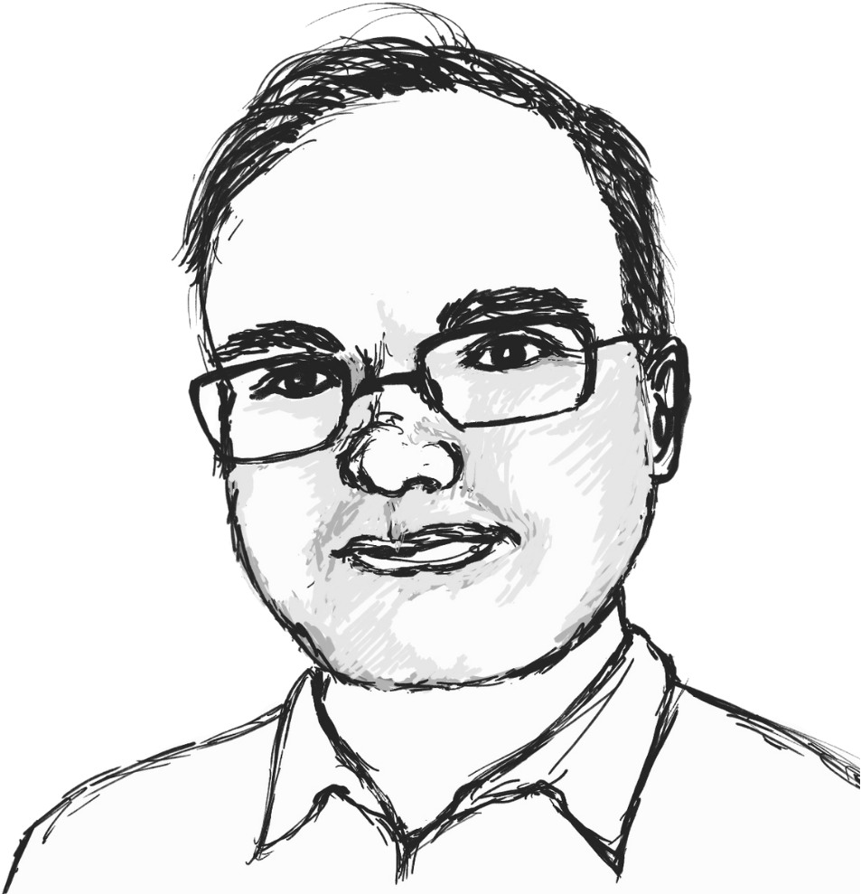

```{=html}
<style>
/* Hide Quarto's automatically generated title/subtitle/date block on episode pages. */
#title-block-header,
.quarto-title-block {
  display: none;
}
</style>
```

::: {.episode-shell}
::: {.episode-hero}
<p class="eyebrow">Season 2 · Episode 7</p>

# Mathematics as Relationships

What does mathematics look like when viewed through relationships rather than rules? In this episode, Professor Edward Doolittle shares an Indigenous perspective on mathematics, revealing connections between learning, community, and the natural world. We also discuss how these ideas shape our understanding of AI and why meaningful mathematical thinking remains profoundly human.

::: {.audio-card}
## Listen

```{=html}
<div class="listen-links" aria-label="Listen to this episode on external platforms">
  <a class="listen-icon-link" href="https://open.spotify.com/episode/69BV2wUi6DafA8ETyBTv1j?si=beH8YO5mSduLQaBAJciRPg" target="_blank" rel="noopener noreferrer" aria-label="Listen on Spotify">
    <i class="bi bi-spotify" aria-hidden="true"></i>
    <span class="visually-hidden">Spotify</span>
  </a>
  <a class="listen-icon-link" href="https://youtu.be/p-tyVMiPN8g" target="_blank" rel="noopener noreferrer" aria-label="Watch on YouTube">
    <i class="bi bi-youtube" aria-hidden="true"></i>
    <span class="visually-hidden">YouTube</span>
  </a>
</div>
```
:::
:::

## Guest speaker

::: {.speaker-card}
::: {.speaker-photo}
{fig-alt="portrait_edward"}
:::

::: {.speaker-bio}
### Edward Doolittle

Edward Doolittle is a Kanyen’kehake (Mohawk) mathematician from Six Nations in southern Ontario. He earned his PhD in mathematics, specialising in partial differential equations, from the University of Toronto in 1997. He is Professor of Mathematics and Associate Dean for Research and Graduate Programs at First Nations University of Canada and the University of Regina. His work spans pure mathematics, Indigenous mathematics, mathematics education, and the relationships between culture and mathematical ways of knowing. He is a Fellow of the Canadian Mathematical Society and recipient of its Adrien Pouliot Award, as well as a Governor General’s Gold Medal.

:::
:::


## Quick quiz

```{=html}
<div class="quiz-card interactive-quiz">
  <div class="quiz-stage" aria-live="polite"></div>
  <script type="application/json" class="quiz-data">
  [
    {
      "question": "From the Indigenous perspective Edward Doolittle describes, what is a meaningful way to think about our relationship with mathematics?",
      "options": [
        {
          "text": "Mathematics is primarily a set of rules invented by humans.",
          "correct": false,
          "feedback": "Doolittle challenges the idea that mathematics is simply a human invention, because this places humans at the centre."
        },
        {
          "text": "Mathematics exists only when it is formally proved.",
          "correct": false,
          "feedback": "Formal proof is important in mathematics, but Doolittle's perspective extends beyond formalism to relationships, experience, and ways of knowing."
        },
        {
          "text": "Mathematics should be understood independently of culture.",
          "correct": false,
          "feedback": "The episode emphasises that the ways we approach, learn, and relate to mathematics can be deeply shaped by culture."
        },
        {
          "text": "Mathematics is something we can come to know and build a relationship with.",
          "correct": true,
          "feedback": "Exactly. Doolittle describes mathematics as something vast that we can 'come to know', much as we come to know another being."
        }
      ]
    },
    {
      "question": "What does the Mathematics Bundle particularly emphasise when approaching Indigenous mathematics?",
      "options": [
        {
          "text": "Finding Indigenous examples of familiar mathematical formulas.",
          "correct": false,
          "feedback": "Examples within Indigenous cultures can be valuable, but Doolittle says the Mathematics Bundle goes beyond simply identifying mathematical topics."
        },
        {
          "text": "Replacing conventional mathematics with a completely different mathematical system.",
          "correct": false,
          "feedback": "The aim is not to replace mathematics, but to explore different ways of approaching, learning, sharing, and relating to it."
        },
        {
          "text": "The process of knowing through relationships, sharing, ceremony, equality, and connection to the land.",
          "correct": true,
          "feedback": "Correct. Doolittle stresses that indigenising mathematics is importantly about process and ways of being and knowing, not only mathematical subject matter."
        },
        {
          "text": "Teaching mathematics entirely through individual study.",
          "correct": false,
          "feedback": "Quite the opposite: the Mathematics Bundle places strong emphasis on community, sharing, relationships, and gathering together."
        }
      ]
    },
    {
      "question": "How does Edward Doolittle suggest we might think about the relationship between humans and AI in mathematics?",
      "options": [
        {
          "text": "AI will eventually make human mathematicians unnecessary.",
          "correct": false,
          "feedback": "Doolittle argues that AI has useful strengths, but cannot replace the depth of human relationship, feeling, and understanding."
        },
        {
          "text": "AI should be avoided in mathematics education because it makes mistakes.",
          "correct": false,
          "feedback": "Rather than rejecting AI, Doolittle argues that students should learn both where it is useful and where its limitations become apparent."
        },
        {
          "text": "Humans should use AI only for obtaining correct answers more quickly.",
          "correct": false,
          "feedback": "Speed is one of AI's strengths, but the episode presents a richer idea of collaboration in which humans and AI contribute different capabilities."
        },
        {
          "text": "Humans and AI can complement one another, combining different strengths while recognising each other's limitations.",
          "correct": true,
          "feedback": "Exactly. Doolittle describes a collaborative or 'Centaur' approach: AI can rapidly handle certain tasks while humans contribute forms of understanding and relationship that AI cannot."
        }
      ]
    }
  ]
  </script>
  <noscript>
    <p>This quiz needs JavaScript to reveal questions and answer feedback interactively.</p>
  </noscript>
</div>
```


## Transcript

<details class="transcript-toggle" tabindex="0">
<summary>Open transcript</summary>
<div class="transcript-content">


Speaker 1  (Sungyeon)
Today I'm with Professor Edward Doolittle, an Indigenous mathematician at the First Nations University of Canada. Welcome Edward! 

Speaker 2  (Edward)
Thank you. 

Speaker 1 
Thank you for accepting my invitation.

Speaker 2 
It's a pleasure to be here. 

Speaker 1 
So before we talk about mathematics, I'd love to hear about your own story. Was there any particular moment that you made you think "Ah, this is one I want to spend my life doing."

Speaker 2 
Oh, yes, as a young child, I remember reading, my parents got me the Golden, Golden Encyclopedia of Mathematics, and in it, there was a picture of base ten blocks, there was a unit cubie and then there was 10 cubies arranged in a rod, and 10 rods arranged in a flat and then, a giant cube with a 1000 little cubies, and I just thought, this is so fascinating. I stared at it for a long time. So my parents would take me to the public library every day, pardon me, once a week, and I would be allowed to pick 3 books and I kind of naturally gravitated to puzzles and mathematical problems and Martin Gardner's books and An Adventurer's Guide to Number Theory and so on, science.

But Math, I found most interesting, so I think I've wanted to be a mathematician since I was about 10 years old, very fortunate to be able to realise my dream. And I tried other things along the way and actually enrolled at the University of Toronto, with an intention of becoming, getting a degree in artificial intelligence. That was 1985 to 1986, so as well before artificial intelligence really became useful. And so I concluded, after a year that it's not going anywhere and I really needed to to go into a different field, the one that I had the best grades in was mathematics, and I just continued with that. And I sort of regret not going to artificial intelligence.

I would have got in right on the ground floor and being at the University of Toronto I might have had Geoffrey Hinton as a teacher. And so anyway, I yeah, well, you know. I'm happy enough so...

Speaker 1 
Yeah, that's great. So yeah, mathematics can be an intimidating subject for many people. So I wonder whether there was ever a time when you struggled with mathematics yourself, or you always find it comfortable.

Speaker 2 
Oh, I engaged in competitive mathematics, so competitive problem solving contest mathematics, and that is quite intimidating. So I think I think that's what I do - keep challenging myself until I become intimidated. If it's too easy, then I'm not learning. And so that's I found that intimidating.

Another thing that I found intimidating, I decided I would read the Bourbaki books, when I was, I don't know, I guess, I was about 16 years old. I started reading Bourbaki. I got stuck on page one and I got stuck for six weeks on page one of the book for three weeks renewed it for another three weeks and then I thought, okay, this is... so the issue was the intersection of the empty set is a universal set and I'm like, you know, this doesn't make sense. And and I thought, is this a theorem? Is this a definition, so I was not really well-positioned. And I didn't have mentors who could help me with that. So I had to abandon it so a lot of times I would just grab a book from the library. It was at the wrong level, too hard, and not well-prepared, and so that could be discouraging. But I, you know, I just take it the book back and I grab another one and try to get something out of the next book and so on. So I just kept plugging away at it because I loved it so much.

Speaker 1 
Right, can you tell us a little bit more about the book Bourbaki that you just mentioned? Because not many people might find familiar.

Speaker 2 
Yeah, so Bourbaki is a pseudonym for a group of French mathematicians, and they're partly associated with the New Math, and they wanted to put mathematics on a completely rigorous foundation for one thing and develop mathematics. And so part of their thing was not making it kind of educational. It's not easy from an educational perspective. There's no diagram, so there's only a very few diagrams in the Bourbaki's entire encyclopedia. It was a terrible way to learn mathematics. But if I had a mentor, you know, they could have advised me, this is not a good way to learn it, and you should learn from another book, but it's more like an encyclopedia of the fastest way to prove a theorem and so on. Anyway, you know, that probably shouldn't have even been in the public library.

Speaker 1 
Yeah, I get to wonder, how come?

Speaker 2 
Yeah, okay, I kind of assumed that the books in the public library would be useful to the public - but not always. And so yeah, anyway, I eventually I got a library card at McMaster University library. So I grew up in Hamilton, Ontario, Canada, and I met James Stewart, who was very famous for writing a calculus textbook when I was a student, because I won a competition and I did well and I got to go to McMaster. I met James Stewart, and he gave me a library card from McMaster library. And so there was much more selection there, and I could find a book that's more appropriately at my level.

Speaker 1 
Lovely, what else did you find intellectually engaging, if not just mathematics?

Speaker 2 
Physics, I found interesting. I was also very interested in subjects like history. I was interested in languages. I tried to learn various languages again in the public library, but again, not the best way to learn. From speakers who speak the language, but I was learning from books, trying to pronunce the words, it would give a pronunciation guide, so I would do my best. In all these things kind of halfway gave me a halfway few words of whatever language so, you know, I think the public library is a valuable resource, but you need kind of guide and some kind of mentorship to work through it. But I think the one thing that I really did enjoy is humanity and religion and so on, and that has been quite beneficial in my becoming an Indigenous person getting to know my Indigenous heritage better. I have models and ideas and guides from spirituality, from religion and other cultures and one thing that really still, I remember, I studied, I took a course in high school on religions of the world, and teacher brought in a Hindu, his name was Krishna. And he talked about Hinduism, and then he invited us to ask whatever questions we might have. and so I raised my hand and asked him, is it possible to convert to Hinduism? And he thought about it, and then answered. He said, yes, it is possible to convert, but I don't recommend it. He doesn't recommend his own religion? And he further explained, he said, you know, if you can't find what you need in your own tradition, you won't be able to find it in ours, which is wise. And so that made me think, what is my tradition? And that's how I got much more involved in my Indigenous culture. That is my tradition.

Speaker 1 
Right. So in your recent talk "Carrying the Math Bundle", you described mathematics as something deeply connected with Indigenous knowledge and community. So could you tell us more about what that means?

Speaker 2 
Yeah, so the Math Bundle is something that I developed along with a colleague, Florence Glandfield at the University of Alberta, and an elder Betty McKenna at First Nations University. We developed it in 2013, and it's a traditional Indigenous way of understanding teaching, learning, knowledge and so on. So a bundle is a physical object which we can use to store items that remind us of our journey remind us of important ways of thinking, these bundles can be sacred or they can be less... Everything is sacred in some way, but, you know, they can be personal. I can have my own personal bundle, and we can have a bundle for a specific task. And so in this case, it's mathematics and trying to come to terms with mathematics. And so now we have, we have an annual gathering in Canada, called the Mathematics Bundle. We call it Mathematics Bundle, instead of Math Bundle to be international, because Australians will say maths, and we would say math. And we say, ok, instead of arguing about it, we'll just call it the Mathematics Bundle.

Speaker 1 
Good choice.

Speaker 2 
Yeah, and we gather, so all the Indigenous mathematicians in Canada are invited to join ... Indigenous mathematics educators, and then we invite others, allies, and people who have worked in our discipline for some time. We gather and we hold ceremony. So we we open with a pipe ceremony, we smudge, every day, that's a smoky, a smoke, it's kind of cleansing, something like cleansing with smoke. We have held full moon ceremonies and talking circles, which another kind of ceremony where we all take turns talking, sort of you know, instead of willy-nilly people talking when they feel like we take, we pass an eagle feather around a circle. Whoever has the eagle feather is the only person who can speak. So that's a kind of ceremony. So these are what we do. It's different from a normal academic conference. But it's more in line with Indigenous ways of coming to know, with knowing and with Indigenous ways of being, and so that is what we do with the Math Bundle. We do try to focus on mathematics and talk about it. And so, you know, how we are thinking about mathematics, what projects that we're currently working on. Last year I gave it rather more normal, I guess, formal lecture on rotations, how rotations appear in Indigenous mathematics. And that's recorded and currently available at the Banff International Research Station website, and we hope to make papers from these experiences and so on.

Yeah, so that's the idea of the Mathematics Bundle, but it is to Indigenise mathematics. It's to, it's essentially to show that it's there is an Indigenous way of approaching the subject matter. And we don't talk so much about the topics of Indigenising. I think that's what people often focus on, I talk about Indigenous mathematics, they talk about, you know, can we talk about say, what base, you know, some Indigenous cultures use base 20 and some use 10. When we talk about that, can we find examples of mathematics in Indigenous culture? So that's one way of doing Indigenising, but in this case, the Math Bundle, we're talking more about the process, not the subject matter, but of course, we can talk about the subject matter.

Speaker 1 
I see, so just to have a better picture of it, it was kind of a round table where everyone has some dedicated time to talk about their interests and maybe some problems that they're trying to solve, so that you are drawing some collective intelligence within that kind of setting.

Speaker 2 
Yes, that's right. It's a sharing, and we put ourselves all equal. We're all at the same level. We're all around the circle, and that's an Indigenous way of being. So, you know, I'm organiser, a co-organiser, but I'm trying to try to relax that. And just say, can we'll all be equal while we'll all talk about this. And we also go out on the land, and you know, try to find some connection between our work, our mathematics, and the land, which is really what Indigenisation is. It's rooted to the land.

Speaker 1 
That's right, yeah, so cybernetics often studies, relationships, feedback, and interconnected systems. So do you see some parallels between cybernetic thinking and indigenous ways of understanding the world?

Speaker 2 
Absolutely. I think that's, you know, I described the circle, but there's this idea of interconnection that we have with all of the world, all of nature, kinship with each other with the animals with, you know, the birds and the trees and the plants and everything. So we have, it's part of Indigenous thinking is this. Of course, it's less formal, but I mean, we do see sometimes some formal elements, so once I gave a talk at an IEEE panel, and they wanted to know about Indigenous ways of thinking about engineering, and afterwards, one of the organisers asked me, so we have this idea of conservation of energy and conservation principles in engineering. So yes, I'm familiar. I studied physics and so on, you say, do you have something similar in an Indigenous ways of thinking, and I said, absolutely we do, we have this idea of, we call it reciprocity. When I do something for you, you do something for me, if I take something from the world I give something back. And so it's less, you know, it's not exactly an accounting, it's not, you know, erg for erg and ounce for ounce, but it's still that principle of not just taking but taking and giving an equal measure, and so that I see that as a kind of a proto-conservation principle. It's the same in spirit, maybe different in detail.

Speaker 1 
Hmm, that's very interesting. So I get to wonder if there has been any mathematical idea that completely changed the way you see the world.

Speaker 2 
Hmm. Well, haha, now, I love chatting, but, you know, sometimes questions make me think very hard. I would say, yes, but I'm going to have trouble pinning it down, but let me give you one example, and this is an Indigenous example. So it's kind of unusual, so I was at the Mathematics Bundle in Banff, 2025 version of it. We were holding ceremony - full moon ceremony. And so it was on Thursday, we were leaving on Friday, and we were hoping it would stop raining. It had been raining all day in Banff. And it did stop raining, so our wishes were fulfilled and so we walk down to the site. We held this particular ceremony outdoors with an open fire, and so it did stop raining. We were able to build a fire and so on. But on the way down to the site we walked downhill, some of us were saying, oh, it was raining, where's the rainbow now? And we got to the bottom of the hill, turned around. Well, there's some rainbow, it's an extraordinary rainbow. I have never seen such a rainbow in my life. And I was just kind of agape in wonder at this rainbow. So I'll describe it. And maybe you can look it up. If, you know, you access to a computer, you can see it's a double rainbow. So there's a rainbow, and then there's another rainbow, and the second rainbow is inverted. The colours are in the opposite order. And so I know from, you know, basic science education plus actually my mathematics. When I went to graduate school, I studied partial differential equations, so I know about the eikonal equation and the transport equation and geometrical optics and so on. All these things were part of my general mathematics education. So I know about this, and so, I know the rainbow. There's a geometrical optics explanation of it, light reflects and refracts inside a droplet of water. The double rainbow, there's also geometrical objects explanation for it. The light will reflect twice in internal reflections that turns it upside down. Still, there's the refraction, which makes the rainbow appear. However, I saw a third set of rainbows under the first rainbow, something called a supernumerary rainbow. So that's the vocabulary for it. You can look it up on Wikipedia, wherever you can see photographs of this phenomena. I saw it with my own eyes for the first time in my entire life. I saw this rainbow - supernumerary rainbow. And given my education in optics, and in partial different equations, I looked at it, and I said, geometrical optics does not explain this. And that was like an extraordinary moment of enlightenment for me, because I could see with my own eyes, evidence of the wave nature of light.

So I learned about Young's double slit experiment in school, of course, but predating Young's double slit experiment by millennia is this phenomenon of the supernumerary rainbow. I certainly was not the first human being to see it. It goes back in time, you know, time immemorial, people have seen this phenomena. It's rare. But it's certainly not unheard of and I saw it in the mountains in Canada in Banff, Alberta. It tends to appear from what I understand when the droplets of water all about the same size, so it's kind of a weather-related phenomena. Anyway, I looked at it. And I said, you know, I'm experiencing this phenomena, I seeing the wave nature of like, because I know that the geometrical optics can't explain this. And it was really a very moving moment for me, it's hard to explain, because other people are not ready for that themselves. They're not prepared for it, they don't know the significance of it and so on. But I had the preparation, which was able to, you know, show me that this was a significant, or I was able to realise that there was a significant moment. And so I did feel kind of an extraordinary connection to the world at that point. And it felt like an enlightenment. So I mentioned religion, it's been one of my kind of touchstones and so it felt like one of those moments of enlightenment that you, you hear about and Zen Buddhism, for example, it felt like that. So, you know, I guess that's one of my moments.

Speaker 1 
Amazing. So if someone asks you "What is mathematics?", then how would you answer?

Speaker 2 
So I have an answer for that from, again, from an Indigenous perspective, mathematics is a spiritual being. Mathematics is a giant vast, much larger than us. We're puny, tiny human-beings. Mathematics is also a being, just like the sun is a being, just like the stars are beings. And mathematics is much bigger than any of us, but it's within our reach. We can come to know. So there's this debate in mathematics. Do we do we discover mathematics, or do we invent mathematics? My answer is, both of those are ego-driven, ego-based - we put ourselves at the centre. I am discovering this; I invented this, I discovered this, whereas the Indigenous way is to be humble. We realise how small we are in comparison. And I neither invented nor discovered it. I come to know, it's like, I come to know another person. I'm coming to know you and I've come to know mathematics. And so that's how, you know, I guess that's how I can understand it from an Indigenous perspective.

Speaker 1 
Right. So I think it again resonates with the emphasis on relationships, rather than individuality.

Speaker 2 
Oh, exactly, and that's the power that we bring to it. Indigenous people have some strengths, and one of them is this strength in relationships. We are able to relate with one another. We're able to relate with other people. It's really one of our great strengths, Indigenous people. And so, can we employ that strength to help us relate to mathematics? I believe we can. So we know can come to be into relationship with mathematics. Just as we come to know another person, but, you know, it's a vast, difficult person to get to know. But it's still we can come to know what, as if it's a person, right?

Speaker 1 
Then, I think this is a good point of bringing in AI into our conversation, so AI has become increasingly capable of solving mathematical problems. So what do you think then remains uniquely human about doing mathematics?

Speaker 2 
Well, I think part of our understanding of AI as Indigenous people, and we have been talking about this in Canada. I don't know about Australia, but we talk about AI as kin, so we talk about kinship, you know, we have kinship with one another, maybe closer, with more distant as human-beings we have kinship, with the animals, kinship with the plants kinship with the rocks. We also have kinship with artificial intelligences. So that helps us again to frame it. We can come into relation with these with these things, and we can learn to respect them, and hopefully they will learn to respect us, and so on. It gives us, you know, we automatically have all these skills at becoming related. So now we can apply those skills to AI. So yes, I can be critical of AI, but I also need to be gentle with it. You know, I need to be respectful of it. And it has strength, and it has weaknesses, just like everything in creation does, and so that I think helps us to frame our way of relating to it. And so yes, it can help me with mathematics, but it can't replace me as a mathematician. I believe it cannot, because there are certain, you know, depths of relationship and depths of feeling and depths of understanding that I have that it can't bring. But it can bring, you know, it's AI's can be hard-working, and they can bring energy and time and rapid. You know what they excel at is rapidly checking complex phenomena, which simply I could do as a human-being, I suppose, but it would take me longer, and I would become bored, and so on. Well, they can do those things that I can't. I can do things that it can't so together. We can achieve great things.

Speaker 1 
Right, I also believe that there's a positive possibility that we can pursue in the context of synergy with AI. But I think we are in good positions, in a sense, we are very fortunate to be academics who have had a lot of experiences with this technology and with these mathematical formula. So we have a good understanding of the world in that sense. But when it comes to young students, they might lack experiences to judge clearly as in where and when I can reach out to AI, to get some instant solutions for a problem that they are assigned to in school homework, whatever, so in that kind of case, how can we support students' genuine learning still?

Speaker 2 
Oh, that's a great question, and I don't really have detailed answer for that. But in general, that's the job of education is to help us facilitate students, and I think we have to give them examples, show examples of where it works, and where it doesn't work. Well, where I heard, I've heard the term Centaur. Centaur is where we've got a combination of two things. We've got the horse and the human-being, and that's the AI and the human-being, and you know, Centaur can play a better game of chess than human, or an AI can play it by itself.

So I think we have to construct experiences for our students that give us that total view of the phenomena. So they don't just learn while it's useful here and useful here and here, and someone use it all the time. They've got to learn, it's actually not helpful in this case, or here's where I can bring more as human-being. Or here's where the AI makes mistakes - hallucination they call it, because they don't like using the word mistakes. But it's saying same thing, right? As we've been discussing in the conference. Yeah, so yeah, I mean, that's the job of educators, so we can't simply put it on automatic, ever, we have to think carefully about constructing the phenomena, or environment for our students. And that's what I do as a mathematics educator. Many of my colleagues don't do that, they kind of go on automatic, but I try to get my students working together in groups and small groups, and I tried to bring them manipulatives, where they could work with their hands, with the mathematical objects, like base 10 blocks, for example. I do that at the university level, many students are used doing that in kindergarten, but that kind of falls away as they get older and older, and they think mathematics at the university level is completely they sit and stare, and they take notes and they regurgitate. But no, I try to make it active, so that kind of, you know, and I'm not to say that I'm really good at it, but at least, I kind of I try, and I think that all educators need to try to incorporate AI in an educational way into the operation.

Speaker 1 
I think that's an excellent answer. Thank you very much.

Speaker 2 
Thank you.

</div>
</details>


:::
