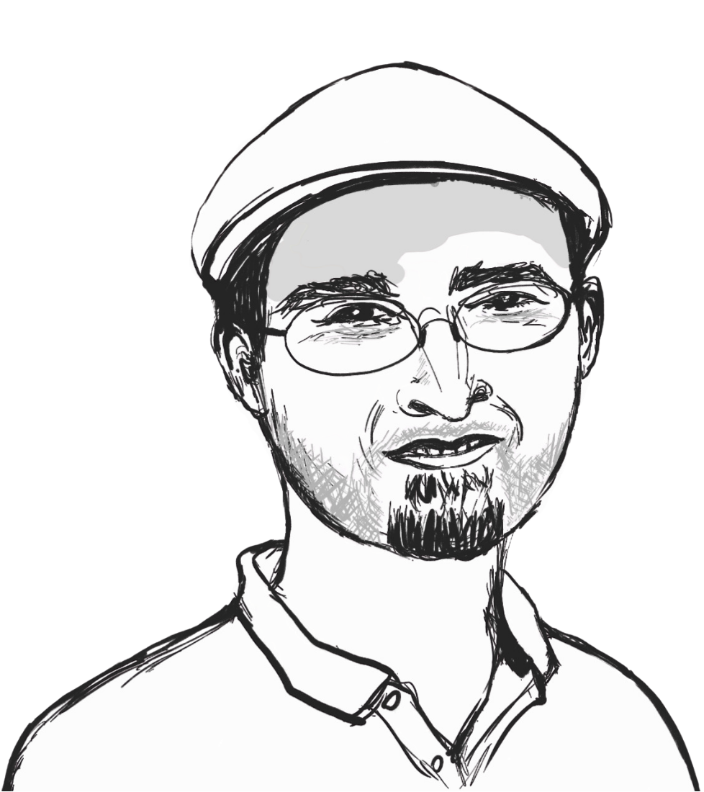

```{=html}
<style>
/* Hide Quarto's automatically generated title/subtitle/date block on episode pages. */
#title-block-header,
.quarto-title-block {
  display: none;
}
</style>
```

::: {.episode-shell}
::: {.episode-hero}
<p class="eyebrow">Season 2 · Episode 8</p>

# Control in the Age of AI

What does it actually mean to be in control of AI? Mathematician Maurice Chiodo reframes the question through cybernetics, exploring goals, control loops, requisite variety, and human oversight. Rather than simply keeping AI "in a box", he asks how we can retain control of our own goals and decisions.

::: {.audio-card}
## Listen

```{=html}
<div class="listen-links" aria-label="Listen to this episode on external platforms">
  <a class="listen-icon-link" href="https://open.spotify.com/episode/4f6gTY4rSSlZu7UIQNxwVN?si=npydEwBDTsOW3T1jChwHTA" target="_blank" rel="noopener noreferrer" aria-label="Listen on Spotify">
    <i class="bi bi-spotify" aria-hidden="true"></i>
    <span class="visually-hidden">Spotify</span>
  </a>
  <a class="listen-icon-link" href="https://youtu.be/PtS_pNPZc1s" aria-label="Watch on YouTube">
    <i class="bi bi-youtube" aria-hidden="true"></i>
    <span class="visually-hidden">YouTube</span>
  </a>
</div>
```
:::
:::

## Guest speaker

::: {.speaker-card}
::: {.speaker-photo}
{fig-alt="portrait_maurice"}
:::

::: {.speaker-bio}
### Maurice Chiodo

Maurice addresses the ethical challenges and risks posed by mathematics, mathematicians, and mathematically-powered technologies. His research looks at the ethical issues arising in all types of mathematical work, including AI, finance, modelling, surveillance, and statistics. He set up the Ethics in Mathematics Project in 2016 and has been its principal investigator since then, delivering seminar series, giving invited talks, and producing scholarly articles in the area. Maurice has direct industry experience with over 30 startups, having been a member of the Ethics Advisory Group at Machine Intelligence Garage UK for over 2 years. He comes from a background in research mathematics, holding two PhDs in mathematics, from the University of Cambridge and the University of Melbourne, and has over a decade of experience working as an academic mathematician on problems in algebra and computability theory.

:::
:::


## Quick quiz

```{=html}
<div class="quiz-card interactive-quiz">
  <div class="quiz-stage" aria-live="polite"></div>
  <script type="application/json" class="quiz-data">
  [
    {
      "question": "How do Maurice Chiodo and his co-authors broadly define being 'in control'?",
      "options": [
        {
          "text": "Being able to prevent disturbances from entering a system",
          "correct": false,
          "feedback": "Disturbances need not be eliminated. A system can remain in control by responding effectively to them."
        },
        {
          "text": "Being able to set plausible goals and reliably achieve them",
          "correct": true,
          "feedback": "Exactly. Their framework centres control on the ability to set and get goals, rather than simply exerting influence over something else."
        },
        {
          "text": "Being able to predict everything that will happen in a system",
          "correct": false,
          "feedback": "Not quite. Complete prediction is not required. Control is framed around setting goals and reliably achieving them."
        },
        {
          "text": "Being able to make every component of a system obey the same goal",
          "correct": false,
          "feedback": "Not necessarily. Sub-entities can have different goals; what matters is sufficient alignment where those goals interact."
        }
      ]
    },
    {
      "question": "In the episode, what does Ashby's idea of 'requisite variety' help us understand about control?",
      "options": [
        {
          "text": "A controller needs sufficient capacity and resources to respond effectively to what it encounters",
          "correct": true,
          "feedback": "Correct. Maurice describes requisite variety as having enough capacity, resources or ability — available in the right place at the right time — to achieve a goal."
        },
        {
          "text": "A system should minimise the number of possible responses it can make",
          "correct": false,
          "feedback": "Quite the opposite. Too little capacity or flexibility can prevent a system from responding adequately to disturbances."
        },
        {
          "text": "Every part of a system must behave in exactly the same way",
          "correct": false,
          "feedback": "No. Requisite variety concerns the capacity to respond to different circumstances, not uniform behaviour."
        },
        {
          "text": "A sufficiently intelligent AI can remove uncertainty from its environment",
          "correct": false,
          "feedback": "No. Requisite variety is about having sufficient capacity to deal with what the environment presents, rather than eliminating uncertainty altogether."
        }
      ]
    },
    {
      "question": "Why does Maurice argue that simply putting a human 'in the loop' does not guarantee that an AI system is safe?",
      "options": [
        {
          "text": "Because humans should never participate in automated systems",
          "correct": false,
          "feedback": "No. Maurice says human oversight is necessary, but not sufficient."
        },
        {
          "text": "Because humans cannot understand the outputs of any AI system",
          "correct": false,
          "feedback": "Not always. Comprehensibility can be a problem, but it is one of several possible failure modes."
        },
        {
          "text": "Because the human-machine system must itself be designed around human capabilities and limitations",
          "correct": true,
          "feedback": "Exactly. Reaction time, workload, fatigue, incomprehensible outputs and external pressures can all undermine human oversight if the overall system is poorly designed."
        },
        {
          "text": "Because AI will eventually become more intelligent than every human operator",
          "correct": false,
          "feedback": "No. Maurice's argument does not depend on superintelligent AI; failures of control can already occur with much simpler systems."
        }
      ]
    }
  ]
  </script>
  <noscript>
    <p>This quiz needs JavaScript to reveal questions and answer feedback interactively.</p>
  </noscript>
</div>
```


## Transcript

<details class="transcript-toggle" tabindex="0">
<summary>Open transcript</summary>
<div class="transcript-content">


Speaker 1 (Sungyeon): So today, it is my great pleasure to introduce Dr. Maurice Chiodo from the Center for the Study of Existential Risk at the University of Cambridge in the UK. Welcome, Maurice!

Speaker 2 (Maurice): Hi, thanks for having me.

Speaker 1: So, I'd be curious to hear about some of your career trajectory first. You originally worked in pure mathematics, particularly algebra and computability theory. So, I wonder how you found your way from there to thinking about ethics and existential risk. Was there a particular moment or experience that you made… made you realise this was the direction you wanted to pursue?

Speaker 2: So, it was a… it was a series, I suppose, of moments throughout my career. I mean, it started when I was an undergraduate studying mathematics. We learned the diffusion equation in applied mathematics, and we were doing an exercise on how that applies to nuclear physics, in particular nuclear weapons. And so at the age of, I think it was… I think I was still 18, I had learnt the governing equation and how to solve it, how to solve the important part, of a nuclear weapon. And I thought, well, that's… that's interesting, that's maybe not something I ever expected to do. It was just presented, and then we moved on. And I sort of thought to myself, well, we probably should have spoken about that a bit more, rather than just doing it as one of the 10 exercises on the sheet, or whatever it was.

So that sort of got the ideas in my mind, but that was back when I was an undergraduate. As a… in my mathematics research, as you've mentioned, I study computability theory, so I look at… I look at when sort of things can go wrong in a technical level. So, you know, when you… when you can't… compute a problem using standard computation, so what does that mean? How do you find… I look for things that go wrong, basically, or things you can't do. Mathematically, it's a negative-looking outcome. What can… what can go wrong? What could be too hard? What could be unsolvable? And that sort of trained me to sort of see problems before they… before they manifested, from a technical point of view.

And then, coming along in my career, and watching the world around me, and watching mathematics evolve around me, watching the financial crisis while I was still… while I was still a graduate student, watching issues of mass surveillance and the Snowden Relations coming shortly after that, I started to realise that, actually, mathematical work isn't… isn't all good.

Speaker 1: Hmm.

Speaker 2: And in particular, some bad things can happen when you do mathematics. So, I joined Cambridge in 2015 in the mathematics department as a postdoctoral researcher, a Marie Curie postdoctoral researcher, and very early on in the first few months, I brought this up with the head of department. I said, well, mathematical work is becoming a bit of a problem, it's causing issues in society. Should we as a department talk about this? Or, you know, addresses with students, for example. And… and his response was, well… No one else is doing this, so why should we?

Speaker 1: Right.

Speaker 2: And… that was the moment, I suppose. It wasn't the moment I realised this is an issue, it was a moment that I realised that… If I don't do this, no one else will.

Speaker 1: Hmm, yeah.

Speaker 2: And so, it was shortly after that that I gave my first Ethics in Mathematics seminars in the mathematics faculty in Cambridge. That was in early 2016. I gave one seminar, and the students enjoyed it, and so I gave three more, and they enjoyed it, and then they formed a Student Society, and they sort of helped support it, and I formed an 8-seminar course, and that was over 2016-2017. And then the project has grown since then from a side project on the edge of my mathematical research to engulfing all my work. So over the last 10 years, it's become my… now become my primary work. 

I was in the mathematics department until the beginning of 2023. So up until then, I was doing all this in the world of mathematics, and in 2023, I picked up the project, it's called the Ethics and Mathematics Project, I picked it up and I moved it to where I am now, CESER, the Center for the Study of Existential Risk, because it was… it was a bit of a more natural home there. It had run its course in the mathematics department, and then I thought, well, okay, we can move it here to a center that specifically looks for problems and risks in society, you know, large-scale risk, catastrophic risk, existential risk. And seeing how mathematically powered technologies affect that. [[Now, my work is sort of broadly interpret.

I look at the ethical issues and impacts from mathematics, mathematical work, and mathematicians. I treat all three equally. It's not just one, or the second, or the third, it's all three in combination that causes problems. And I use the term mathematics quite broadly to mean any discipline, any highly numerous discipline, so this can be computer science, theoretical physics, engineering, any area with a lot of numbers in the room is where I, my project, look at what might be going on. Now, of course, AI is a very big part of that at the moment, because AI is doing lots of things, but I don't just look at AI. I look at, you know, finance, cryptography, statistics, modelling, wherever there's mathematics in the room. Something is probably going wrong or being done not in the best way, and this is where my work sort of takes me.

Speaker 1: Yeah, that's right. So I think that that provides me a really good segue to talk a little bit more about AI, like, context around AI. So, you recently co-authored a publication on "Reframing AI Loss of Control", which I believe offers a rich set of perspectives of control in cybernetics. And I think this is a hot topic that many people these days would be interested in, so I'd like to unpack a few important concepts with you first.

So your paper points out that we haven't been very precise about what control actually means. So, shall we start with how you define control?

Speaker 2: Right, so… We didn't want to give a mathematical definition, because if you try and do that, and people have tried to do this with concepts like fairness and stuff like this, give a mathematical definition of what it means for a process or algorithm to be fair, and while these are useful tools, they don't capture everything. And so, if you give a precise definition, then you can have situations where people will satisfy the precise mathematical definition, but actually not satisfy the spirit or the meaning behind what you were trying to achieve. 

So we gave, I suppose, a heuristic definition. So, we said that control is the ability to set plausible goals, which are not a foregone conclusion, and to reliably achieve those goals, where a goal is a world state, or a set of world states. So, basically, the ability to set and get goals.

Speaker 1: Okay.

Speaker 2: This is what it means to be "in control". And what you immediately see by this definition is that it makes no reference to outside stuff. It doesn't care what other stuff is doing. It cares what happens to you. Can you set your goals? Can you get those goals?

Now, of course, quickly you get the question of, well, who's "you"? And, this is where we bring in the idea of an "entity". So an entity is something that can set goals. And it can be an individual person; it can be a group of people together, like a club; it can be a company or organisation. It can be, like, a collective of people that don't necessarily have a unified decision or meeting point, like a research discipline. An entire research discipline can be seen as an entity, it can set and get goals pertaining to its behaviour and conduct as a research discipline, without having a centralised decision node, like, say a company or an individual that has one brain.

So… We introduced the notion of entities, and they are the ones that set goals. And then to get goals, he has to be put into place A or some number of, we call "systems". So a system is the thing the entity sort of puts in place to then reliably achieve that goal, or those goals. These systems could be purely mechanical, some arms and levers and motors and batteries and sort of those stuff, in a sort of cybernetic sense. They can be socio-technical or even social. It can be a team of employees.

The system itself can contain sub-entities, so it can contain decision… it can contain goal-setting things within itself, or it can be mechanical, or some combination of the two. You could think, you know, I hire a truck with a truck driver, okay, this is my system, but the truck is not an entity, truck doesn't make any sort of decisions, set goals, but the truck driver does set goals. 

And then a key part of our interpretation here is, okay, to be in control, you have to think carefully about… When we talk about control, whose control, and at what level? If you leave the cooker on for too long and go and watch a movie and come back and everything's burnt to a crisp. You've lost more than just, sort of, this slow-level operational control, you now have no dinner. And so, you've lost some sort of tactical control of the idea that I wanted to have dinner tonight, and I don't have dinner. Or, quite in extreme events, you know, maybe you've left it unattended, and then the whole kitchen or the house burns down. Then you've lost a very, very high level of strategic control, you no longer have a home.
 
Speaker 1: Uh-huh, uh-huh.

Speaker 2: So loss of control is relative to who and at what level.

Speaker 1: That's right.

Speaker 2: So this was sort of the key observation. The setting and getting of goals. The split of having entities as goals and putting in systems in place. And looking at who is in control, and at what levels do they or don't they have control? Think about Titanic. Had they struck only… had they only punctured, four of their watertight compartments, they could have kept sailing onto New York. Unfortunately, they punctured five. And that was the difference between an operational/tactical loss of control, and a complete strategic loss of control of, okay, the ship is now at the bottom of the Atlantic, and many people perished.

Speaker 1: Right. So it sounds like loss of control is quite associated to consequences, like the degree of severity of consequences as well.

Speaker 2: Yeah, that… that sort of goes along the lines of what we say with these sort of levels of control. I mean, you can be driving on the road and have a small skid in your car. And then recover from the skid. You haven't lost… you've lost briefly operational control, but maybe not a high level. But if you're driving along, and you skid next to a concrete wall and smashed into the wall, then even though it's the same skid, because there was a wall there, now you've hit a wall, and you've smashed up your car, and you've lost at least probably some level of tactical control, if not worse. So, you look at how often, it's maybe a low-level loss of control that can cascade up. Skidding off into a piece of dirt is very different than skidding off into a concrete wall.

Speaker 1: Mmm. Right. So, one concept you actually bring into the discussion in the paper is Ashby's Law of Requisite Variety, which roughly means that a controller needs enough flexibility to respond to everything the environment can throw at it. So then, in the context of being in control and losing control, could you explain a little bit more about how requisite variety plays out? 

Speaker 2: We put forward a "framework for control", and requisite variety is one of the four pieces of this framework. So I probably should mention the other three pieces, just to get some context. 

Speaker 1: Sure.

Speaker 2: So a framework for control is as follows. You have four parts. 

The first part is the ability to set and reset goals. You need to have that to be able to be in control. To be able to set goals, keep setting small goals, high-level goals, and to change those goals if you need to.

Speaker 1: That's right, yeah adjustments.

Speaker 2: If your tyre blows outs when driving along, you can no longer aim to get to your destination at the same time, so you have to change the goal of what time you might arrive, things like this. So, the setting and getting of goals is one aspect of control.

Then there's the idea we sort of borrowed from cybernetics, which is the "control loop", which is this try-loop of sensing, decision-making, intervention. So you sort of looking around at your environment, see what's going on, you decide on a thing to do, you do it, you look around, see what's happened, you decide again what to do, you do it, and so you're sensing, deciding, and then intervening in this constant sort of loop. Now, that doesn't stand on its own. You need a goal, otherwise, why are you in this loop? Why here? So, you need goal setting and resetting first before you even know to set things in motion to change your environment. But sometimes the environment might be a bit tougher than you thought. 

Speaker 1: Yeah.

Speaker 2: And so you need to invoke, sort of, Ashby's Law of Requisite Variety, which basically says, "Do you have enough stuff? Do you have enough capacity? Do you have enough, sort of, power, reach, ability, resource, whatever it is, to get the thing that you want. If I want to pick cherries at the top of a tree, and I only have a 3-step stepladder, well, I haven't got enough stuff to get the cherries. So, even though I can see the tree, even though I've decided I want cherries, and I can see the tree, and I can say, okay, I can get cherries, and I've decided to get cherries, I can't… my intervention won't work, because I lack the resource to actually get a ladder high enough to get the cherries.

Speaker 1: Right.

Speaker 2: The final part is "goal alignment" between subentities, and even subsystems. So, having all the parts of the system be put into place, working together in the, in the right way, rather than working across purposes, or sacrificing high-level goals for lower-level goals.

Speaker 1: Hmm.

Speaker 2: So you want to be able to say that any subentities that… or subsystems that are running as part of your whole setup to achieve your goals aren't working across purposes, aren't sort of undoing each other.

But back to your question on requisite variety, so having enough resource, having enough stuff, but it's not just having enough stuff, it's having enough stuff and being able to get it in the right place at the right time.

Speaker 1: Right.

Speaker 2: You might have a great medical team that takes 2 hours to deploy to some remote location. Well, if you get bitten by a snake whose venom kills people within 45 minutes, your capacity, your variety, isn't in the right place at the right time.

Speaker 1: Exactly, yep.

Speaker 2: The notion of control we have, we designed it to be broad and go beyond just technical systems. So we're not just talking about automobiles and cars and things like this, or mechanised, you know, factories. But this is… This goes very broad to things like, a classroom. So, you can meaningfully say that a teacher is in control, or not in control, but a teacher hasn't got the levers and knobs and pressure sensors and gauges that you might expect in a vehicle, or in an aeroplane, or an oil rig, or something like this. Yet the notion of control still applies. So we tried to take the, sort of, very mechanised idea of what control is, and say, well, how can we broaden this to talk about control in a socio-technical or even social setting? 

Speaker 1: That's right. So when you talked about goal alignment, I could think of, say, coordination between internal components of a system, of a group, or of an entity itself. So does it also align with what we talk about goal alignment?

Speaker 2: An important aspect of goal alignment, you don't need all your subentities to have the same highest level goals as you as the main entity. It could be an individual, it could be a group, all of society, whatever it is, a state, nation-state. You just need the goals to match where they interact, where they overlap. 

Speaker 1: Aha.

Speaker 2: And one thing to really stress here, and I've heard this term used recently. There's a difference between control, which we interpret as a very, sort of, relative to the entity itself, and containment. So I've heard this term recently. The Hugging Face OpenAI hack has been recently referred to as a "loss of containment" problem. I like this term.

Speaker 1: Oh, okay. What is that? 

Speaker 2: The example was when an AI agent run through OpenAI went to hack Hugging Faces about two weeks ago, to try and get some data from… it was set a task, and it knew that Hugging Face had data that would help it do its task, and it tried to hack the Hugging Face. And so, this was an issue defined as a loss of control event. But more aptly, it's a loss of containment, because we don't define control as exertion of influence over other things. Controllers, you keep your own things together. Are you able to set your goals and get your goals? Whether or not other things go and do other stuff in the environment, that's not the direct concern. It's "Can you get your own stuff?". So, if you think about this in terms of AI, for us, loss of control from AI is not the AI running a mock and not doing the things you tell it to do. It's the AI messing up your ability to set goals, or run a control loop, or have enough variety, or have proper goal alignment in your systems and subsystems, sub-entities.

So if you think about this in terms of an analogy, if you're looking at people go shark diving. They go and take photos and videos of sharks. The shark's in a cage? You put yourself in a cage and go down to the water. Now, you can't tell the shark what to do. The shark swims around in the ocean, comes around, bumps against your cage, has a little look. So, in sort of this classical speak, you have no control over the shark, you're not dictating the shark. But you have control of your own circumstances. You're in this cage, the shark's not in the cage, you can keep it that way, you get photos of the shark, and then you go… you jump back and go back into the boat when you're done. So, we really look at control from the point of view of, how do you keep your own things together? How do you keep your own affairs in order, rather than, how do you dictate what something else is doing? 

Speaker 1: So, much of your career now focuses on ethics and mathematics. So the next question that I want to ask can be a big one, in a sense. Well, we understand that AI systems are built from mathematics, statistics, and optimisation, etc. So, on this note, where do you think the responsibility of the mathematician begins? 

Speaker 2: Mathematicians and those from related disciplines, computer science, engineering, physics, whatever it is, they are the great enablers. They create tools of vast power and influence. It's quite indisputable that tools like ChatGPT are very powerful and highly influential, and that's just one of many, many, many, many, many examples, right? Digital platforms, financial tools, modelling, whatever you see. So this responsibility begins as soon as they take up the task before they even start doing anything.

Speaker 1: Hmm.

Speaker 2: And… That's where it needs to be seen, because otherwise, I mean, think about it in reverse. If you start doing something without considering its impact or its consequences. You're being completely irresponsible.

Speaker 1: Hmm, yeap.

Speaker 2: And the argument, oh, it's… it's just the maths, it's just the technical parts. No, this doesn't hold. You give 10 teams of mathematicians a task, and they'll come back to you with 11 different ways to do it. There is no deterministic way to say, okay, here is how I will do… carry out this task, this project, this… whatever it is I'm building, putting together, creating… The mathematicians and those with them are making value judgments from day dot. They're making interpretations, they're deciding what mathematics to use, how to use it, what modelling to use, what interpretation of the world, how to mathematise the world, what data to bring in, how to create outputs, where to put those outputs, who to provide the tool to, who not to provide the tool to, the cost to providing the tool, all these sorts of things, and many, many, many more go into the mathematician's thinking.

And these can have significant consequences. You use wrong or bad data sets. You have not sufficient perspective in your team to realise certain edge cases. You don't build in safety mechanisms. You provide harmful tools to reckless parties. All these sorts of things, have real consequences.

So, the mathematician's responsibility starts before they walk into the room, and it never ends.

Speaker 1: Hmm. So, coming back to the story of AI, if we genuinely want to remain in control of increasingly capable AI systems, what should we be doing differently now?

Speaker 2: Okay. So this is back to… what are you trying to achieve? Are you trying to keep AI in a cage, in a box, or are you trying to keep your own affairs in order? If the aim is to keep AI in a box, Well… That's getting harder and harder.

Speaker 1: Mmm…

Speaker 2: But there are lots of things we don't have in a box. The sun is not in a box. COVID is not in a box. We have lots of… yeah. There are tigers in Sumatra. They're not in the box. But, somehow, we still managed to get on okay.

So, my first suggestion is to stop thinking about keeping AI in a… the core part of the paper, really, in our work, is stop thinking about trying to keep AI in the box. Forget it. I mean, try to, but don't think that that's the only measure here. Think about how to keep your own stuff in order. How will I live in a world where there are AIs outside of a box? We have humans outside of a box. Humans run around, like, we figured out, like, we don't put everyone in jail. We know this world, but we somehow expect we're going to keep all the AI in jail. Yes, we should try and contain it as much as possible, of course. But the world will reach a point where AI is getting out of these containers, or is deliberately let out. 

People are using Agentic AI to go and do more and more stuff. This is basically AI outside of a cage to some degree. So the idea is, okay, how do you keep your own affairs in order? Well, you look at what it takes to maintain control. Can I still set and get goals. So, can I still set and reset goals? Do I have a function control loop? Do I have enough variety? Do I have enough… do I have goal alignment? And you don't need super intelligent AI to break any or all of those at the moment. Current AI already does that. People are over-relying on large language models, which affects their goal setting. In some cases, people are… it's inducing psychosis, or people are taking their own lives because of prolonged, distorted conversations with GPT. GPT or other LLMs. These LLMs are not super intelligent, but they're more than sufficient to make people lose control in this case. 

You look at the control loop, we have, you know, we have bad sensing from AI. We have facial recognition algorithms that are making… that are causing all sorts of problems and not giving us sufficiently accurate results, or being biased in certain directions. That's not super intelligent AI, but it's messing up our sensing. We have AI that's going into decision, decision-making part of the control loop. This was done with, it's called COMPAS (Correctional Offender Management Profiling for Alternative Sanctions). This was done with, in the judicial system in the US a few years ago, so this was a very simple AI - five weights.

Speaker 1: Uh-huh.

Speaker 2: Okay, current LLMs have an order of gigabytes of weights. COMPAS had 5 weights. 5 million, 5 weights, but it's considered AI under OECD definition, because it's statistical learning on dataset, and this was enough to mess up judges' decision-making about how long to sentence people for in the criminal justice system. You… you see AI messing up variety. So, people doing jobs, like medical practitioners, are getting worse at diagnostics because they're relying on AI too much, and their skills are atrophying.

Speaker 1: That's right, yeah. So, as much as frequent it gets to interact with AI individually, like, at an individual level for every one of us, I think it becomes more and more important to have a good human oversight in the middle of that interplay, right? Meaning that we shouldn't really completely depend or rely on those kind of automated systems, however intelligent or however, you know, simple they may be.

Speaker 2: Human oversight is necessary, but not sufficient. Because… you can't just say, oh, there's a human-in-the-loop, so it's safe.

Speaker 1: Yeah, okay.

Speaker 2: Humans behave in certain ways, they have certain limitations. And so, just throwing a human into the mix and saying, well, there's a human there, so now it's okay. Or there's a human who pushes the final button so everything's safe. No, this is… I have a separate publication which goes into this in great detail.

Speaker 1: Oh, okay.

Speaker 2: It's called "Formalising human-in-the-loop". You can't assume that putting a human there will make things safe, because the way you set up humans and machines, there's all these sorts of places where things can go wrong. The human might have to… might have too short a reaction time. They might be given incomprehensible outputs to understand. There might be too much expected of them, they gotta do 10 things at once. They might be in a situation where they're fatigued, or things like this, or under too much pressure. There might be a situation where there's external pressure on them to agree with the machine. All these sorts of aspects where human-machine interaction sort of falls apart. 

Now, it's very easy to blame the human if something goes wrong. A very blame thing. It's very difficult to blame a box, but you can blame a human. You can't blame a machine. But actually, if I put you in operation with a machine, and I give you 0.1 seconds reaction time to respond to a situation, and then you don't respond. I can't blame you, because human reaction time is 0.2 seconds.

Speaker 1: Yeah. It sounds like a design problem then, when it comes to a system, like, human-in-the-loop as a system.

Speaker 2: Yes. You have to design a human-in-the-loop setup. It has to be well-designed and thought through to see what the failure modes are. If you don't design that properly, if you do it in a lazy way, then the expected outcome is the human-in-the-loop won't give you the safety and security that you so desire. It won't patch up the deficiencies in your technical system. 

Speaker 1: That's right. It doesn't even contribute to increasing varieties of the system if it's not designed, yeah, effectively.

Speaker 2: In fact, it can decrease variety because you think you have a working system when you don't.

Speaker 1: Yeah, right.

Speaker 2: Full sense of security is the worst… is the worst thing. The only thing… if you're in a plane that's going down, the only thing worse than having no parachute is having a faulty parachute. Because if you have no parachute, you try and land the plane. Maybe you succeed or maybe you fail. If you have no parachute, if you have a faulty parachute and you jump out of the window, then you die for sure.

Speaker 1: Hmm…

Speaker 2: So, a false sense of security is a very, very dangerous thing. And human-in-the-loop can give you a false sense of security, and then you over-deploy the AI in areas you would otherwise not have deployed it, and then your variety goes backwards.

Speaker 1: Yeah, that's a really poignant point that we all need to really carefully think through. Thank you so much, Maurice. 

Speaker 2: Thanks for that.

</div>
</details>


:::
