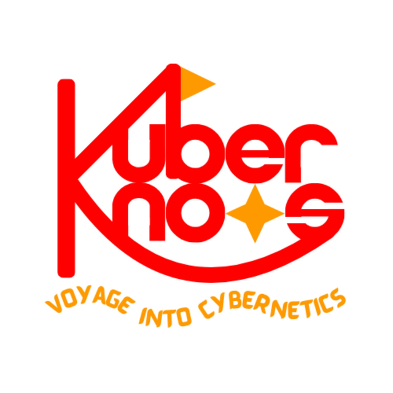

::: {.hero}
{.hero-logo}

::: {.hero-copy}

Kuberknots | Voyage into Cybernetics

# Untangling cybernetics, one conversation at a time.

Cybernetics may sound abstract. Kuberknots makes it feel navigable: feedback, communication, control, autonomy, and complex systems explained through warm conversations with researchers, practitioners, and curious thinkers.

::: {.hero-actions}
[Start with the latest episode](episodes/ep-007.qmd){.btn .btn-primary}
[Explore all episodes](episodes.qmd){.btn .btn-secondary}
:::
:::
:::

::: {.topic-strip aria-label="Podcast themes"}
Feedback loops
Human and technology
AI and society
Systems thinking
Complex Systems
:::

::: {.section-heading}
## Recent episodes

Check out our recent episodes or browse around for further exploration!
:::

:::{.recent-episodes-wrap}
:::{#recent-episodes}
:::
:::
