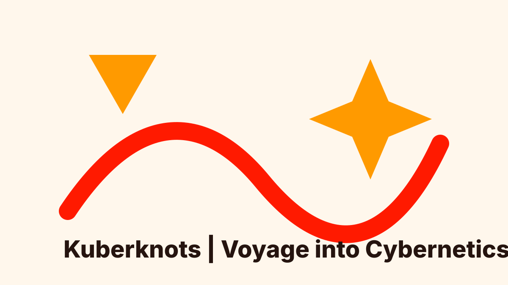

::: {.hero}
{.hero-logo}

::: {.hero-copy}

Kuberknots | Voyage into Cybernetics

# Untangling cybernetics, one conversation at a time.

Cybernetics may sound abstract. Kuberknots makes it feel navigable: feedback, communication, control, autonomy, and complex systems explained through warm conversations with researchers, practitioners, and curious thinkers.

::: {.hero-actions}
[Start with the latest episode](episodes/ep-006.qmd){.btn .btn-primary}
[Explore all episodes](episodes.qmd){.btn .btn-secondary}
:::
:::
:::

::: {.topic-strip aria-label="Podcast themes"}
Feedback loops
Human–technology relations
AI and society
Systems thinking
:::

::: {.section-heading}
## Recent episodes

Check out our recent episodes or browse around for further exploration!
:::

::: {.latest-grid}
::: {.episode-card}
{.episode-thumb}

Episode 6

### How Cemeteries and Solar Panels Explain Modern Energy Systems

Paolo Scarabaggio explains smart energy systems through multi-agent systems, energy communities, solar panels, and fairness.

[Open episode](episodes/ep-006.qmd){.episode-link}
:::

::: {.episode-card}
{.episode-thumb}

Episode 5

### Game Theory and Decision Making

Iman Shames introduces game theory, Nash equilibrium, belief hierarchies, and everyday choices in human and human-machine interaction.

[Open episode](episodes/ep-005.qmd){.episode-link}
:::

::: {.episode-card}
{.episode-thumb}

Episode 4

### From Classical to Quantum Control

Ian Petersen explains how feedback systems power everyday technology and the quantum technologies of tomorrow.

[Open episode](episodes/ep-004.qmd){.episode-link}
:::
:::

